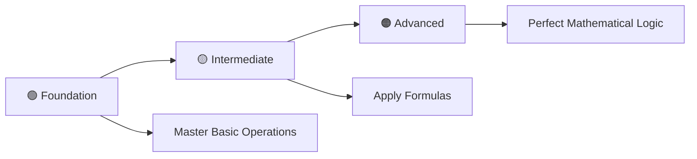

# 🚀 C++ Programming: Basic Practice Problems

<div align="center">

[](https://en.wikipedia.org/wiki/C_(programming_language))
[](https://github.com/rohit528590/CtoCPP-Journey/tree/main/02_Basics_Practice_Problems)
[](https://github.com/rohit528590/CtoCPP-Journey/tree/main/02_Basics_Practice_Problems)
[](https://github.com/rohit528590/CtoCPP-Journey/tree/main/02_Basics_Practice_Problems)

### Welcome to the **Basic Practice Problems** module of **CtoCPP-Journey**! 🎯


*Master fundamental C++ programming through hands-on practice with 22 carefully crafted problems designed to build your coding confidence from the ground up.*

</div>

---

## 📋 Table of Contents

- [🎯 Learning Objectives](#-learning-objectives)
- [🛠️ Getting Started](#️-getting-started)
- [🏗️ Problem Categories](#️-problem-categories)
- [🎯 Recommended Learning Path](#-recommended-learning-path)
- [💻 Code Examples](#-code-examples)
- [💡 Key Concepts Covered](#-key-concepts-covered)
- [🎓 What's Next?](#-whats-next)
- [🤝 Resources & Support](#-resources--support)

---

## 🎯 Learning Objectives

By completing these problems, you will master:

- **🖥️ Basic Input/Output Operations** with `cout` and `cin`
- **➕ Arithmetic Operations** and mathematical calculations
- **🏷️ Data Types** usage (`int`, `float`, `const`, `#define`)
- **🔄 Type Casting** and precision handling
- **📐 Mathematical Formulas** implementation in C++
- **🧠 Problem-solving Skills** through practical applications

---

## 🛠️ Getting Started

<details>
<summary><strong>🎯 Prerequisites</strong></summary>

- Basic understanding of C++ syntax
- GCC compiler or any C++ compiler
- Text editor or IDE (Code::Blocks, Dev-C++, VS Code)

</details>

### Compilation & Execution

```bash
# Clone the repository
git clone https://github.com/rohit528590/CtoCPP-Journey.git

# Change directory
cd CtoCPP-Journey/02_Basics_Practice_Problems

# Compile any program
g++ filename.cpp -o output

# Run the program
./output

# Example with Problem 1
g++ 01_Sum_of_2_Given_Number.cpp -o sum
./sum
```

<details>
<summary><strong>🎯 Recommended Learning Path</strong></summary>

1. **Start with Foundation Level** (Problems 1-8)
2. **Practice daily** - Solve 2-3 problems per day
3. **Understand concepts** before moving to next level
4. **Experiment** with different inputs and modifications
5. **Review and optimize** your solutions

---
</details>

## 🏗️ Problem Categories

### 🟢 Foundation Level (Problems 1-8)

*Master the basics of C++ programming with simple arithmetic and geometry*  

| # | 📁 **Problem** | 📊 **Difficulty** | 🔑 **Key Concepts** |
|---|---------|------------|--------------|
| 01 | [Sum of Two Numbers](01_Sum_of_2_Given_Number.cpp) | ⭐ | 📊 Basic I/O, Float operations |
| 02 | [Cube of a Number](02_Cube_of_N.cpp) | ⭐ | 🔢 Integer arithmetic, Power operations |
| 03 | [Perimeter of Square](03_Perimeter_of_Square.cpp) | ⭐ | 📐 Geometry formulas, Float precision |
| 04 | [Perimeter of Rectangle](04_Perimeter_of_rectangle.cpp) | ⭐ | 📏 Multiple inputs, Formula application |
| 05 | [Area of Rectangle](05_Area_of_rectangle.cpp) | ⭐ | 📦 Basic multiplication, Geometry |
| 06 | [Area of Square](06_Area_of_Square.cpp) | ⭐ | 🔲 Square operations, Formatting |
| 07 | [Area of Circle](07_Area_of_circle.cpp) | ⭐⭐ | 🔴 `#define` preprocessor, Pi constant |
| 08 | [Circumference of Circle](08_Circumference_of_circle.cpp) | ⭐⭐ | ⭕ Mathematical constants, Circle geometry |

**🎯 Focus Areas:** Basic syntax, simple calculations, understanding input/output patterns

---

### 🟡 Intermediate Level (Problems 9-16)

*Apply mathematical concepts and explore advanced operations*  

| # | 📁 **Problem** | 📊 **Difficulty** | 🔑 **Key Concepts** |
|---|---------|------------|--------------|
| 09 | [Calculating Percentage](09_Calculating_Percentage.cpp) | ⭐⭐ | 📈 Multiple inputs, Percentage calculations |
| 10 | [Simple Interest](10_Calculate_Simple_Interest.cpp) | ⭐⭐ | 💰 Financial mathematics, Formula implementation |
| 11 | [Find Remainder (Manual)](11_Find_Remainder.cpp) | ⭐⭐⭐ | 🧮 Division logic, Mathematical reasoning |
| 12 | [Find Remainder (Modulus)](12_Finding_remainder_using_moduls.cpp) | ⭐⭐ | ➗ Modulus operator, Comparison with manual method |
| 13 | [Half of Number](13_Half_of_Number.cpp) | ⭐⭐ | ➗ Division operations, Float precision |
| 14 | [Fractional Part Extract](14_Fractional_Part_of_Float_N.cpp) | ⭐⭐⭐ | 🔢 Type casting, Float manipulation |
| 15 | [Volume of Cylinder](15_Volume_of_cylinder.cpp) | ⭐⭐⭐ | 🥫 3D geometry, Complex formulas |
| 16 | [Volume of Sphere](16_Volume_of_Sphere.cpp) | ⭐⭐⭐ | ⚽ `const` keyword, Advanced geometry |

**🎯 Focus Areas:** Complex calculations, type conversions, mathematical logic

---

### 🟠 Advanced Level (Problems 17-22)  

*Master temperature conversions and formula transformations*  

| # | 📁 **Problem** | 📊 **Difficulty** | 🔑 **Key Concepts** |
|---|---------|------------|--------------|
| 17 | [Celsius to Fahrenheit](17_Celsius_to_Fahrenheit.cpp) | ⭐⭐⭐ | 🌡️ Temperature conversion, Formula application |
| 18 | [Celsius to Kelvin](18_Celsius_to_Kelvin.cpp) | ⭐⭐⭐ | ❄️ Scientific units, Precision handling |
| 19 | [Fahrenheit to Celsius](19_Fahrenheit_to_Celsius.cpp) | ⭐⭐⭐ | 🔄 Reverse formula calculation |
| 20 | [Fahrenheit to Kelvin](20_Fahrenheit_to_Kelvin.cpp) | ⭐⭐⭐⭐ | 🔥 Multi-step conversions |
| 21 | [Kelvin to Celsius](21_Kelvin_to_Celsius.cpp) | ⭐⭐⭐ | 🧊 Scientific temperature scales |
| 22 | [Kelvin to Fahrenheit](22_Kelvin_to_Fahrenheit.cpp) | ⭐⭐⭐⭐ | ⚡ Complex formula implementation |

**🎯 Focus Areas:** Formula manipulation, scientific calculations, precision control

---

## 🎯 **Recommended Learning Path**



**💡 Pro Tip**: Progress through each level systematically - each problem builds essential skills for the next!

---

## 💻 Code Examples

### 🔹 Pattern 1: Basic Input/Output

```cpp
#include <iostream>
using namespace std;
int main() {
    float number;
    cout << "Enter a number: ";
    cin >> number;
    printf("Result: %.2f\n", number * 2);
    return 0;
}
```

### 🔹 Pattern 2: Mathematical Calculations

```cpp
#include <iostream>
#define PI 22.0/7.0
using namespace std;
int main() {
    float radius = 5.0;
    float area = PI * radius * radius;
    cout << "Area: " << area << endl;
    return 0;
}
```

### 🔹 Pattern 3: Multiple Inputs

```cpp
#include <iostream>
using namespace std;
int main() {
    float length, breadth;
    cout << "Enter length: ";
    cin >> length;
    cout << "Enter breadth: ";
    cin >> breadth;
    cout << "Area: " << length * breadth << endl;
    return 0;
}
```

### 🔹 Pattern 4: Division Without Modulus Operator

```cpp
int num = 17, divisor = 5;
int quotient = num / divisor;
int remainder = num - (quotient * divisor);
cout << "Remainder: " << remainder << endl;
```

### 🔹 Pattern 5: Financial Computation

```cpp
float principal = 1000, rate = 5, time = 2;
float si = (principal * rate * time) / 100;
cout << "Simple Interest: " << si << endl;
```

---

## 💡 Key Concepts Covered

| Concept | Problems | Description |
|---------|----------|-------------|
| **Basic I/O** | 1-22 | `cout`, `cin`, format specifiers |
| **Data Types** | 1-22 | `int`, `float`, type selection |
| **Arithmetic Ops** | 1-16 | `+`, `-`, `*`, `/`, operator precedence |
| **Preprocessor** | 7, 8, 15 | `#define`, macro definitions |
| **Constants** | 16 | `const` keyword usage |
| **Type Casting** | 14 | `(int)`, explicit conversions |
| **Modulus** | 11, 12 | `%` operator, remainder calculations |
| **Formatting** | 1-22 | Precision control with `%.2f`, `%.3f` |

---

## 🎓 What's Next?

Ready to level up your C++ programming journey? Here's your personalized learning roadmap:

### 🚀 Immediate Next Challenge

- **[🔀 Decision Making & Conditionals](../03_If-Else)** - Master C++ fundamentals through 22 progressive coding challenges with detailed solutions and comprehensive explanations

### 🌟 Topics Awaiting You

- **Conditional Logic**: `if`, `else`, `else if` statements for decision making
- **Loop Structures**: `for`, `while`, `do-while` iterations for repetitive tasks
- **Pattern Generation**: Visual patterns and mathematical sequences using loops
- **Control Flow**: `break`, `continue`, and nested structures

---

## 🤝 Resources & Support

<div align="center">

| 📚 **Resource Type** | 🔗 **Access Point** | 📝 **Description** |
|---------------------|---------------------|-------------------|
| **Bug Reports & Questions** | [Open an Issue](https://github.com/rohit528590/CtoCPP-Journey/issues) | Report bugs or ask technical questions |
| **Community Support** | [GitHub Issues](https://github.com/rohit528590/CtoCPP-Journey/issues) | Get help with coding problems and technical questions |
| **Contribute** | [Fork Repository](https://github.com/rohit528590/CtoCPP-Journey/fork) | Help improve the course for everyone |

</div>

---

<div align="center">

## 🎉 **Ready to Start Your Programming Journey?**

**Follow the exact progression from your carefully crafted examples!**

[](01_Sum_of_2_Given_Number.cpp)
[](09_Calculating_Percentage.cpp)
[](17_Celsius_to_Fahrenheit.cpp)

### 🌟 **Remember:**

*Every expert programmer started exactly where you are now. The key is consistent practice and curiosity to learn!*

---

### 💪 Your Structured Learning Path

<div align="center">

```
🟢 Foundation Level      🟡 Intermediate Level      🟠 Advanced Level
   (Problems 1-8)          (Problems 9-16)           (Problems 17-22)
       ↓                        ↓                         ↓
   Basic I/O & Math      Complex Calculations    Temperature Conversions
```

**📈 Structured Path:** `Foundation Mastery` → `Mathematical Proficiency` → `Advanced Applications`

</div>

---

### 🔗 **Support This Project**

[](https://github.com/rohit528590/CtoCPP-Journey/stargazers)
[](https://github.com/rohit528590/CtoCPP-Journey/network/members)

**⭐ [Star this Repository](https://github.com/rohit528590/CtoCPP-Journey) to show your support!**

*Happy Coding, future programmer! 🚀👨‍💻👩‍💻*  

<sub>Built with ❤️ for C++ programming students | Based on proven learning progression | <a href="https://github.com/rohit528590/CtoCPP-Journey">CtoCPP-Journey Project</a></sub>
</div>
