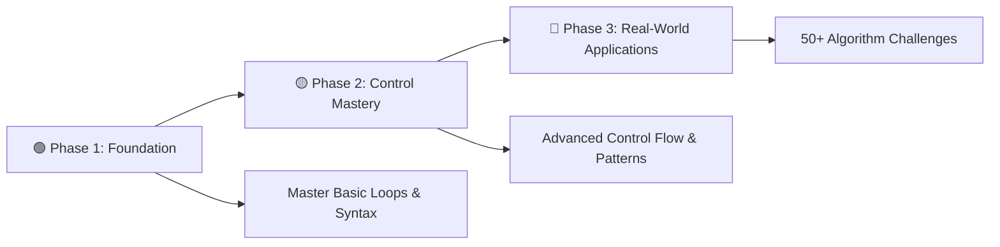

# 🔄 Loops & Iteration in C++ Programming

<div align="center">

[](https://en.wikipedia.org/wiki/C_(programming_language))
[](https://github.com/rohit528590/CtoCPP-Journey/tree/main/05_Loops)
[](https://github.com/rohit528590/CtoCPP-Journey/tree/main/05_Loops)
[](https://github.com/rohit528590/CtoCPP-Journey/tree/main/05_Loops)
[](https://github.com/rohit528590/CtoCPP-Journey/tree/main/06_Loops_Practice_Problems)
[](https://github.com/rohit528590/CtoCPP-Journey/tree/main/07_Pattern_Printing_Practice_Problems)

### Welcome to the **Loops & Iteration** module of **CtoCPP-Journey**! 🎯


*A comprehensive, structured journey through C++ programming loops with hands-on practice, real-world applications, and progressive skill development*  

</div>

---

## 📋 Table of Contents

- [🌟 Overview](#-overview)
- [🚀 Quick Start](#-quick-start)
- [📚 Learning Path](#-learning-path)
- [🏆 Practice Challenges](#-practice-challenges)
- [🎯 Recommended Learning Path](#-recommended-learning-path)
- [💻 Code Examples](#-code-examples)
- [📖 Reference Guide](#-reference-guide)
- [🎓 What's Next?](#-whats-next)
- [🤝 Resources & Support](#-resources--support)

---

## 🌟 Overview

Welcome to the **Loops & Iteration** module of **CtoCPP-Journey**! 🔄 Master the art of efficient programming through powerful iteration techniques that eliminate repetitive code.

> **🚀 Why Loops Matter:** Transform manual repetition into automated solutions - from data processing to pattern generation!

### 🎯 What You'll Master

- 🔢 **Increment/Decrement**: Master `++i` vs `i++` operators
- 🔄 **Loop Types**: Perfect `for`, `while`, `do-while` selection
- ⚡ **Flow Control**: `break`, `continue`, nested structures
- 🎨 **Pattern Design**: Visual patterns & mathematical sequences
- 🏎️ **Performance**: Optimized iteration techniques
- 💼 **Real Applications**: Interactive programs & practical solutions

---

## 🚀 Quick Start

### Prerequisites

- Basic C++ syntax knowledge (variables, input/output, conditionals)
- A C++ compiler (GCC recommended)
- Text editor or IDE

### 🏃‍♂️ Get Started in 3 Steps

```bash
# 1. Clone the repository
git clone https://github.com/rohit528590/CtoCPP-Journey.git

# 2. Navigate to the Loops directory
cd CtoCPP-Journey/05_Loops

# 2. Compile your first program
g++ 03_for_loop.cpp -o my_first_loop  

# 3. Run and see the magic!
./my_first_loop
```

### 💡 Your First Loop Program

```cpp
#include <iostream>
using namespace std;

int main() {
    cout << "🎉 Welcome to C++ Loops!\n\n";
    
    // Countdown from 10 to 1 (from your actual code)
    for (int i = 10; i >= 1; i--) {
        cout << "🚀 " << i << " ";
    }
    cout << "\n🎯 Blast off!\n";
    
    return 0;
}
```

---

## 📚 Learning Path

Our structured approach follows your actual file progression, taking you from basic operators to advanced iteration patterns:

### 🟢 Phase 1: Foundation

*Master the fundamentals of operators and basic loops*  

| # | 📁 **File** | 📊 **Difficulty** | 🔑 **Key Skills** |
|---|------|-------------------|------------|
| 01 | [Increment Operators](01_Increment_operators.cpp) | ⭐ | ⬆️ `++i` vs `i++`, assignment behavior |
| 02 | [Decrement Operators](02_Decrement_operators.cpp) | ⭐ | ⬇️ `--i` vs `i--`, loop counter control |
| 03 | [For Loop](03_for_loop.cpp) | ⭐⭐ | 🔄 Initialization, condition, decrement |
| 04 | [While Loop](04_While_loop.cpp) | ⭐⭐ | 🔁 Pre-test loops, counter increment |
| 05 | [Do While Loop](05_Do_While_loop.cpp) | ⭐⭐ | 🔂 Post-test loops, guaranteed execution |
| 06 | [Quick Quiz](06_Quick_Quize.cpp) | ⭐⭐ | 🧩 For + while in sequence |

**🎯 Goal:** Understand operator behavior and write basic loop structures

### 🟡 Phase 2: Control Mastery

*Learn advanced loop control and complex patterns*  

| # | 📁 **File** | 📊 **Difficulty** | 🔑 **Key Skills** |
|---|------|-------------------|------------|
| 07 | [Break Statements](07_Break_Statements.cpp) | ⭐⭐ | 🛑 Early loop termination, exit conditions |
| 08 | [Continue Statements](08_Continue_Statements.cpp) | ⭐⭐ | ⏭️ Skip iterations, filtering logic |
| 09 | [Nested Loops](09_Nested_loops.cpp) | ⭐⭐⭐ | 🏗️ 2D pattern creation, user input |
| 10 | [Quiz: Nested Loop](10_Quize_based_on_nested_loop.cpp) | ⭐⭐⭐ | 📐 Fixed pattern creation |
| 11 | [Infinite Loops](11_Infinite_Loops.cpp) | ⭐⭐ | ♾️ Understanding endless loops, CPU impact |

**🎯 Goal:** Master loop control flow and create sophisticated patterns

### 🔴 Phase 3: Real-World Applications

*Apply loops to solve extensive practical problems*  

| 📁 **Resource** | 📊 **Difficulty** | 🔑 **Skills Developed** |
|----------|-------------------|------------------|
| [Loops Practice Problems.txt](Practice_Problem_Based_on_Loops.txt) | ⭐⭐⭐ | 🧮 Mathematical computations, data processing, prime numbers, factorials, palindromes, Armstrong numbers |
| [Pattern Printing Practice Problems.txt](Practice_Problem_Based_on_Pattern_Printing.txt) | ⭐⭐⭐⭐ | 🎨 Complex geometric patterns, triangles, diamonds, hollow shapes, number patterns |

**🎯 Goal:** Build professional-grade applications with optimal loop performance

---

## 🏆 Practice Challenges

Based on your actual practice files, here are the challenge categories:

### 📁 **Core Loop Practice** - [Loops Practice Problems.txt](Practice_Problem_Based_on_Loops.txt)

<details>
<summary><strong>🥉 Beginner Level (20 Problems)</strong></summary>

**Basic I/O & Counting:**

- Print hello world 'n' times
- Print numbers within given range
- Print odd/even numbers in range
- Natural number sequences with exclusions

**Mathematical Computations:**

- Multiplication tables (normal & reverse)
- Sum calculations for ranges
- ASCII value printing
- Basic arithmetic progressions

**Number Properties:**

- Factorial calculations
- Prime number detection
- Fibonacci sequences
- Digit counting and manipulation

</details>

<details>
<summary><strong>🥈 Intermediate Level (15 Problems)</strong></summary>

**Advanced Mathematics:**

- Geometric progressions
- Power calculations
- Prime number ranges
- Series summations with alternating signs

**Number Analysis:**

- Palindrome detection
- Armstrong numbers
- Digit sum calculations
- Number reversal

**Input Processing:**

- Conditional input loops
- Multiple of 7 detection
- Odd number stopping conditions

</details>

<details>
<summary><strong>🥇 Advanced Level (15 Problems)</strong></summary>

**Complex Algorithms:**

- Armstrong number ranges
- Advanced digit manipulations
- Multiple condition validations
- Composite algorithm combinations

</details>

### 📁 **Pattern Mastery** - [Pattern Printing Practice Problems.txt](Practice_Problem_Based_on_Pattern_Printing.txt)

<details>
<summary><strong>🎨 Pattern Categories (40+ Patterns)</strong></summary>

**Basic Shapes:**

- Rectangle and square patterns
- Triangle variations (left, right, inverted)
- Number and alphabet triangles

**Intermediate Patterns:**

- Hollow rectangles and shapes
- Floyd's triangles
- Alternating patterns
- Centered pyramids

**Advanced Designs:**

- Diamond patterns
- Symmetric shapes
- Complex number arrangements
- Multi-layered geometric designs

**Expert Level:**

- Hollow pyramids
- Mirror patterns
- Mathematical sequences in shapes
- Custom geometric arrangements

</details>

---

## 🎯 **Recommended Learning Path**



**💡 Pro Tip**: Complete all 11 core files sequentially, then tackle the 90+ practice problems - master `while`, `for`, and `do-while` loops before advancing to nested loops and complex pattern algorithms!

---

## 💻 Code Examples

<details>
<summary><strong>⚡ Advanced Control Flow (Files 07-08)</strong></summary>

**Break Statement Examples [(from 07_Break_Statements.cpp)](07_Break_Statements.cpp):**

```cpp
#include <iostream>
using namespace std;

int main() {
    // Example 1: For loop with break
    for (int i = 1; i <= 10; i++) {
        if (i == 5) {
            break; // Exit the loop when i is 5
        }
        cout << i << "\n";
    } // Prints: 1, 2, 3, 4
    
    // Example 2: While loop with break
    int r = 1;
    while (r <= 10) {
        if (r == 4)
            break; // Exit the loop when r is 4
        cout << r << "\n";
        r++;
    } // Prints: 1, 2, 3
    
    return 0;
}
```

**Continue Statement Examples [(from 08_Continue_Statements.cpp)](08_Continue_Statements.cpp):**

```cpp
#include <iostream>
using namespace std;

int main() {
    // Skip printing when i is 3
    for (int i = 1; i <= 5; i++) {
        if (i == 3) {
            continue; // Skip printing when i is 3
        }
        cout << i << "\n";
    } // Prints: 1, 2, 4, 5
    
    return 0;
}
```

</details>

<details>
<summary><strong>🎨 Pattern Generation (Files 09-10)</strong></summary>

**Interactive Star Pattern [(from 09_Nested_loops.cpp)](09_Nested_loops.cpp):**

```cpp
#include <iostream>
using namespace std;

int main() {
    int row, column;
    cout << " Enter Number of Row : ";
    cin >> row;
    cout << " Enter how many number of stars you want in each column : ";
    cin >> column;
    
    for (int i = 0; i <= row; i++) {
        for (int j = 0; j <= column; j++) {
            cout << " *";
        }
        cout << "\n";
    }
    return 0;
}
```

**Fixed 4x4 Square Pattern [(from 10_Quize_based_on_nested_loop.cpp)](10_Quize_based_on_nested_loop.cpp):**

```cpp
#include <iostream>
using namespace std;

int main() {
    // Create exactly this pattern:
    // * * * *
    // * * * *
    // * * * *
    // * * * *
    for (int i = 1; i <= 4; i++) {
        for (int j = 1; j <= 4; j++) {
            cout << " *";
        }
        cout << "\n";
    }
    return 0;
}
```

</details>

---

## 📖 Reference Guide

### 🔄 Loop Types

### 1. `for` Loop

- **Use when:** The number of iterations is known.
- **Syntax:**

  ```cpp
  for (initialization; condition; increment/decrement) {
      // Code to execute
  }
  ```

- **Example:**

  ```cpp
  for (int i = 10; i >= 1; i--) {
      cout << i << " ";
  }
  ```

### 2. `while` Loop

- **Use when:** The number of iterations is unknown; condition is checked before each iteration.
- **Syntax:**

  ```cpp
  while (condition) {
      // Code to execute
  }
  ```

- **Example:**

  ```cpp
  int i = 1;
  while (i <= 5) {
      cout << i << "\n";
      i++;
  }
  ```

### 3. `do-while` Loop

- **Use when:** The loop body must execute at least once; condition is checked after each iteration.
- **Syntax:**

  ```cpp
  do {
      // Code to execute
  } while (condition);
  ```

- **Example:**

  ```cpp
  int i = 1;
  do {
      cout << "i = " << i << "\n";
      i++;
  } while (i <= 5);
  ```

### 4. Nested Loops

- **Definition:** A loop inside another loop.
- **Use for:** Pattern printing, multidimensional data, etc.
- **Example:**

  ```cpp
  for (int i = 0; i < rows; i++) {
      for (int j = 0; j < columns; j++) {
          cout << "*";
      }
      cout << "\n";
  }
  ```

---

### 🧮 Operator Behavior

```cpp
// Pre-increment: increment happens BEFORE assignment
int i = 5;
int a = ++i;  // a = 6, i = 6
cout << "Pre-increment: a = " << a << ", i = " << i << "\n";

// Post-increment: increment happens AFTER assignment  
i = 6;
int b = i++;  // b = 6, i = 7
cout << "Post-increment: b = " << b << ", i = " << i << "\n";

// Pre-decrement: decrement happens BEFORE assignment
int r = 5;
int s = --r;  // s = 4, r = 4
cout << "Pre-decrement: s = " << s << ", r = " << r << "\n";

// Post-decrement: decrement happens AFTER assignment
r = 4;
int q = r--;  // q = 4, r = 3
cout << "Post-decrement: q = " << q << ", r = " << r << "\n";
```

### ⚡ Performance Tips

| Concept | Your Example | Best Practice |
|---------|--------------|---------------|
| **🔍 Variable scope** | `for (int i = 10; i >= 1; i--)` | Declare loop variables in for statement |
| **🔗 Loop continuation** | Combined for+while in Quiz | Use same variable for seamless continuation |
| **🚪 Early exit** | `if (i == 5) break;` | Use break to exit when condition met |
| **⏭️ Skip iterations** | `if (i == 3) continue;` | Use continue to skip unwanted iterations |

### 🚨 Common Pitfalls

| Problem | Your Code Shows | Solution |
|---------|-----------------|----------|
| **♾️ Infinite loops** | `while(1) {}`, `for(;;) {}` | Always ensure loop variable changes |
| **📏 Off-by-one** | Careful with `<=` vs `<` | Your examples use consistent boundaries |
| **🔢 Variable tracking** | Post/pre increment confusion | Practice with your increment operator examples |

---

## 🎓 What's Next?

Ready to level up your C programming journey? Here's your personalized learning roadmap:

### 🚀 Immediate Next Challenge

- **[🔄 Loops Practice Problems](../06_Loops_Practice_Problems)** - Master iterative programming with 41 progressive challenges covering all loop types, algorithms, and optimization techniques with Step by Step Solutions

- **[🎨 Pattern Printing Practice Problems](../07_Pattern_Printing_Practice_Problems)** - Create stunning geometric patterns with 33 expert-level challenges from basic shapes to complex symmetric designs with Step by Step Solutions

### 🌟 Topics Awaiting You

- **⚙️ Functions & Modularity**: Build reusable code with parameter optimization and modular design patterns
- **🔄 Recursive Algorithms**: Master divide-and-conquer techniques with stack optimization and iterative conversions
- **📊 Data Structures & Arrays**: Implement multi-dimensional arrays, matrix operations, and efficient memory management

---

## 🤝 Resources & Support

<div align="center">

| 📚 **Resource Type** | 🔗 **Access Point** | 📝 **Description** |
|---------------------|---------------------|-------------------|
| **🔄 Loops Practice Problems** | [Loops Practice Problems.txt](Practice_Problem_Based_on_Loops.txt) | 50+ loop challenges to master iteration concepts |
| **🎨 Pattern Printing Practice** | [Pattern Printing Practice Problems.txt](Practice_Problem_Based_on_Pattern_Printing.txt) | 40+ pattern problems for nested loop mastery |
| **🐛 Bug Reports & Questions** | [Open an Issue](https://github.com/rohit528590/CtoCPP-Journey/issues) | Report bugs or ask technical questions |
| **💬 Community Support** | [GitHub Issues](https://github.com/rohit528590/CtoCPP-Journey/issues) | Get help with coding problems and technical questions |
| **🤝 Contribute** | [Fork Repository](https://github.com/rohit528590/CtoCPP-Journey/fork) | Help improve the course for everyone |

</div>

---

<div align="center">

## 🚀 Ready to Master C Loops?

**Follow the exact progression from your carefully crafted examples!**

[](01_Increment_operators.cpp)
[](03_for_loop.cpp)
[](09_Nested_loops.cpp)

### 🌟 **Remember:**

*Every expert programmer started exactly where you are now. The key is consistent practice and curiosity to learn!*

---

### 💪 Your Structured Learning Path

<div align="center">

```
🟢 Foundation Phase      🟡 Control Mastery      🔴 Real-World Applications
   (Files 01-06)          (Files 07-11)           (90+ Practice Problems)
       ↓                       ↓                         ↓
   Basic Loop Structures   Advanced Control Flow    Professional Applications
```

**📈 Progressive Journey:** `Loop Fundamentals` → `Control Mastery` → `Algorithm Excellence`

</div>

---

### 🔗 **Support This Project**

[](https://github.com/rohit528590/CtoCPP-Journey/stargazers)
[](https://github.com/rohit528590/CtoCPP-Journey/network/members)

**⭐ [Star this Repository](https://github.com/rohit528590/CtoCPP-Journey) to show your support!**

*Happy Coding, future programmer! 🚀👨‍💻👩‍💻*  

<sub>Built with ❤️ for C programming students | Based on proven learning progression | <a href="https://github.com/rohit528590/CtoCPP-Journey">CtoCPP-Journey Project</a></sub>
</div>
