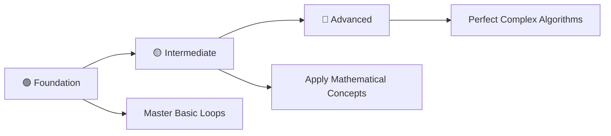

# 🔥 Loop Mastery: Complete C++ Programming Challenge

> **Master Loops Through 41 Progressive Programming Problems**

<div align="center">

[](https://en.wikipedia.org/wiki/C_(programming_language))
[](https://github.com/rohit528590/CtoCPP-Journey/06_Loops_Practice_Problems)
[](https://github.com/rohit528590/CtoCPP-Journey/tree/main/06_Loops_Practice_Problems)
[](https://github.com/rohit528590/CtoCPP-Journey/tree/main/06_Loops_Practice_Problems)
[](https://github.com/rohit528590/CtoCPP-Journey/tree/main/06_Loops_Practice_Problems)

### Welcome to the **Loops Practice Problems** module of **CtoCPP-Journey**! 🎯


*Master loops through **41 progressive challenges** covering fundamental concepts to advanced algorithms with real-world applications.*

</div>

---

## 📋 Table of Contents

- [📖 Overview](#-overview)
- [⚡ Quick Start Guide](#-quick-start-guide)
- [📚 Problem Categories](#-problem-categories)
- [🎯 Recommended Learning Path](#-recommended-learning-path)
- [🔄 Iterative Examples](#-iterative-examples)
- [🎓 What's Next?](#-whats-next)
- [🤝 Resources & Support](#-resources--support)

---

## 📖 Overview

This repository contains **41 carefully crafted C programming problems** focused exclusively on loops and iteration. Each problem builds upon previous concepts while introducing new challenges, perfect for mastering control structures and algorithmic thinking.

### 🎯 Learning Objectives

- **🔄 Master Loop Fundamentals**: for, while, and do-while structures
- **🧠 Develop Algorithmic Thinking**: Decompose problems into iterative solutions
- **📊 Practice Mathematical Programming**: Arithmetic sequences to number theory
- **🌍 Real-World Problem Solving**: Professional programming scenarios
- **🔀 Multiple Solution Approaches**: Compare loop types and optimizations
- **💡 Strengthen Analytical Skills**: Logic, patterns, and debugging

---

## ⚡ Quick Start Guide

### Prerequisites

- Any C++ compiler (GCC, Dev-C++, Code::Blocks)
- Text editor or IDE
- Enthusiasm to learn! 🔥

### Getting Started

```bash
# Clone the repository
git clone https://github.com/rohit528590/CtoCPP-Journey.git

# Change directory
cd CtoCPP-Journey/06_Loops_Practice_Problems

# Compile any program
g++ filename.cpp -o output

# Run the program
./output

# Example with Problem 1
g++ 01_Hellow_World_N_times.cpp -o hellow_world
./hellow_world
```

---

## 📚 Problem Categories

### 🟢 **Foundation Level** (Problems 1-13)

*Build your loop fundamentals with essential concepts*  

| # | 📁 **Problem** | 📊 **Difficulty** | 🔑 **Key Concepts** |
|---|---------|-------------------|--------------------------------------|
| 01 | [Hello World N Times](01_Hellow_World_N_times.cpp) | ⭐ | 🔄 Basic for loops and iteration |
| 02 | [Numbers in Range](02_Printing_Numbers_in_range.cpp) | ⭐ | 📏 Range iteration and boundaries |
| 03 | [Range with Exclusions](03_Print_R_to_S_except_i_to_k.cpp) | ⭐⭐ | ⏭️ Conditional loops and skip logic |
| 04 | [Odd Numbers R to S](04_Odd_Number_R_to_S.cpp) | ⭐⭐ | 🔢 Number filtering and conditions |
| 05 | [Odd Numbers with Continue](05_Odd_Numbers_in_range_using_continue.cpp) | ⭐⭐ | ⏩ Continue statement and flow control |
| 06 | [Multiplication Table](06_Table_of_N.cpp) | ⭐⭐ | ✖️ Mathematical loops and tables |
| 07 | [Reverse Table](07_Reverse_Table_of_N.cpp) | ⭐⭐ | 🔄 Reverse iteration patterns |
| 08 | [Sum of Table](08_Sum_of_table_of_N.cpp) | ⭐⭐ | ➕ Accumulation and running totals |
| 09 | [Sum Range (For Loop)](09_Sum_from_R_to_S_using_for-loop.cpp) | ⭐⭐ | 🔄 For loop mastery and summation |
| 10 | [Sum Range (While Loop)](10_Sum_in_range_using_while-loop.cpp) | ⭐⭐ | 🔁 While loop comparison |
| 11 | [Even Numbers](11_Even_Number_in_range.cpp) | ⭐⭐ | 🎯 Even filtering and patterns |
| 12 | [ASCII Values (For)](12_ASCII_values_of_Characters_for_loop.cpp) | ⭐⭐ | 🔤 Character processing and ASCII |
| 13 | [ASCII Values (While)](13_Printing_ASCII_values_while_loop.cpp) | ⭐⭐ | 🔀 Loop variants and approaches |

**Learning Goals**: Master basic loop syntax, understand different loop types, and practice simple iterations.

### 🟡 **Intermediate Level** (Problems 14-29)

*Develop analytical thinking and optimization skills*  

| # | 📁 **Problem** | 📊 **Difficulty** | 🔑 **Key Concepts** |
|---|---------|-------------------|--------------------------------------|
| 14 | [Factorial of N](14_Factorial_of_N.cpp) | ⭐⭐ | ❗ Factorial algorithms |
| 15 | [Factorial in Range](15_Factorial_in_range.cpp) | ⭐⭐ | 📊 Range processing |
| 16 | [Nth Fibonacci](16_Nth_Fibonacci_Number.cpp) | ⭐⭐⭐ | 🌀 Fibonacci sequences |
| 17 | [Fibonacci Series](17_Fibonacci_Series_From_First_to_N.cpp) | ⭐⭐⭐ | 📈 Complete sequence generation |
| 18 | [AP: 1,3,5,7...](18_AP_1,3,5,7,_upto_N.cpp) | ⭐⭐ | ➕ Arithmetic progressions |
| 19 | [AP: 4,7,10...](19_AP_4,7,10_upto_N.cpp) | ⭐⭐ | 🔢 Custom arithmetic patterns |
| 20 | [GP: 1,2,4,8...](20_GP_1,2,4,8_upto_N.cpp) | ⭐⭐⭐ | ✖️ Geometric progressions |
| 21 | [GP: 3,12,48...](21_GP_3,12,48.cpp) | ⭐⭐⭐ | 📐 Custom geometric patterns |
| 22 | [GP: 100,50,25...](22_GP_100,50,25_upto_N.cpp) | ⭐⭐ | ⬇️ Decreasing geometric series |
| 23 | [GP: Positive Terms Only](23_GP_100,97,94_upto_positive_term.cpp) | ⭐⭐⭐ | ✅ Conditional termination |
| 24 | [Power Calculation](24_Raised_to_the_power.cpp) | ⭐⭐ | ⚡ Exponentiation algorithms |
| 25 | [Prime Check](25_Prime_or_Composite.cpp) | ⭐⭐⭐ | 🔍 Prime number detection |
| 26 | [Prime Check (While)](26_Check_Prime_or_Composite_using_while-loop.cpp) | ⭐⭐⭐ | 🔄 Alternative prime checking |
| 27 | [N Prime Numbers](27_Print_N_prime_number.cpp) | ⭐⭐⭐⭐ | 🎯 Prime generation algorithms |
| 28 | [Series: 1,-2,+3,-4...](28_Sum_Series:1,-2,+3,-4_upto_N.cpp) | ⭐⭐⭐ | ➖ Alternating sign series |
| 29 | [Series: -1,2,-3,4...](29_Sum_Series:-1,2,-3,4.cpp) | ⭐⭐⭐ | 🔄 Pattern variations |

**Learning Goals**: Master complex mathematical operations, understand algorithmic efficiency, and develop problem-solving strategies.

### 🔴 **Advanced Level** (Problems 30-41)

*Tackle sophisticated loop applications and algorithms*  

| # | 🎯 **Challenge** | 📊 **Difficulty** | 🔑 **Key Concepts** |
|---|------------------|-------------------|--------------------------------------|
| 30 | [Count Digits](30_Count_Digit_of_N.cpp) | ⭐⭐⭐ | 🔢 Digit processing |
| 31 | [Reverse Number](31_Reverse_of_N.cpp) | ⭐⭐⭐ | 🔄 Number manipulation |
| 32 | [Sum of Digits](32_Sum_of_digits_of_N.cpp) | ⭐⭐⭐ | ➕ Digit summation |
| 33 | [Sum Even Digits](33_Sum_of_Even_digits_of_N.cpp) | ⭐⭐⭐ | 🎯 Conditional digit operations |
| 34 | [Sum Odd Digits](34_Sum_of_Odd_Digits_of_N.cpp) | ⭐⭐⭐ | 🔢 Selective digit processing |
| 35 | [Digits Sum & Reverse](35_Sum_of_Digits_of_N_and_its_Reverse.cpp) | ⭐⭐⭐⭐ | 🔄 Multi-step algorithms |
| 36 | [Sum to Reverse](36_Sum_of_N_to_its_reverse.cpp) | ⭐⭐⭐⭐ | ➕ Advanced number operations |
| 37 | [Input Until Odd](37_Taking_Input_until_odd_Number.cpp) | ⭐⭐⭐ | ⌨️ Dynamic input termination |
| 38 | [Input Until Multiple of 7](38_Taking_Input_until_mutiplication_of_7.cpp) | ⭐⭐⭐ | ✅ Custom validation loops |
| 39 | [Palindrome Check](39_Palindrome_or_not.cpp) | ⭐⭐⭐⭐ | 🪞 Symmetry detection |
| 40 | [Armstrong Number](40_Armstrong_Number_or_not.cpp) | ⭐⭐⭐⭐ | 🎯 Special number properties |
| 41 | [Armstrong in Range](41_Armstrong_Number_in_Range.cpp) | ⭐⭐⭐⭐ | 🔍 Complex range validation |

**Learning Goals**: Master advanced number theory, implement complex algorithms, and develop expertise in sophisticated loop applications.

---

### 🎯 **Recommended Learning Path**



**💡 Pro Tip**: Complete problems in sequence for optimal skill building!

---

## 🔄 Iterative Examples

### 1. Print Numbers in a Range

```cpp
int r = 1, s = 10;
for (int i = r; i <= s; i++) {
    cout << i << " ";
}
```

### 2. Sum in a Range (While Loop)

```cpp
int r = 1, s = 5, sum = 0;
while (r <= s) {
    sum += r;
    r++;
}
cout << "Sum: " << sum << "\n";
```

### 3. Factorial of N

```cpp
int n = 5, fact = 1;
for (int i = 1; i <= n; i++) {
    fact *= i;
}
cout << "Factorial: " << fact << "\n";
```

### 4. Prime Check

```cpp
int n = 7, isPrime = 1;
for (int i = 2; i < n; i++) {
    if (n % i == 0) {
        isPrime = 0;
        break;
    }
}
cout << (isPrime ? "Prime\n" : "Not Prime\n");
```

### 5. Input Until Condition (Multiple of 7)

```cpp
int num;
do {
    cout << "Enter a number: ";
    cin >> num;
} while (num % 7 != 0);
cout << "You entered a multiple of 7!\n";
```

---

## 🎓 What's Next?

Ready to level up your C++ programming journey? Here's your personalized learning roadmap:

### 🚀 Immediate Next Challenge

- **[🎨 Pattern Printing Practice Problems](../07_Pattern_Printing_Practice_Problems)** - Create stunning geometric patterns with 33 expert-level challenges from basic shapes to complex symmetric designs

### 🌟 Topics Awaiting You

- 📄 **Functions**: Creating functions 🔧 for repetitive tasks
- 🔁 **Recursion**: Creating recursive functions 🔃 for efficient problem-solving
- 📈 **Data Structures**: Arrays 📊 for storing and manipulating sequences, 2D Arrays 📋 for matrix operations

---

## 🤝 Resources & Support

<div align="center">

| 📚 **Resource Type** | 🔗 **Access Point** | 📝 **Description** |
|---------------------|---------------------|-------------------|
| **🐛 Bug Reports & Questions** | [Open an Issue](https://github.com/rohit528590/CtoCPP-Journey/issues) | Report bugs or ask technical questions |
| **💬 Community Support** | [GitHub Issues](https://github.com/rohit528590/CtoCPP-Journey/issues) | Get help with coding problems and technical questions |
| **🤝 Contribute** | [Fork Repository](https://github.com/rohit528590/CtoCPP-Journey/fork) | Help improve the course for everyone |

</div>

---

<div align="center">

### 🌟 Ready to Master Loops?

**Choose your starting point and begin your coding journey!**

[](01_Hellow_World_N_times.cpp)
[](14_Factorial_of_N.cpp)
[](30_Count_Digit_of_N.cpp)

---

### 💪 Your Structured Learning Path

<div align="center">

```
🟢 Foundation Level      🟡 Intermediate Level      🟠 Advanced Level
   (Problems 1-13)          (Problems 14-29)           (Problems 30-41)
       ↓                        ↓                         ↓
   Basic Loops    Real-World Scenarios    Algorithm Mastery
```

**📈 Structured Path:** `Foundation Mastery` → `Real-World Proficiency` → `Advanced Applications`

</div>

---

### 🔗 **Support This Project**

<div align="center">

[](https://github.com/rohit528590/CtoCPP-Journey/stargazers)
[](https://github.com/rohit528590/CtoCPP-Journey/network/members)

**⭐ [Star this Repository](https://github.com/rohit528590/CtoCPP-Journey) to show your support!**

</div>

*Happy Coding, future programmer! 🚀👨‍💻👩‍💻*  

</div>

<div align="center">
<sub>Built with ❤️ for C++ programming students | Based on proven learning progression | <a href="https://github.com/rohit528590/CtoCPP-Journey">CtoCPP-Journey Project</a></sub>
</div>
