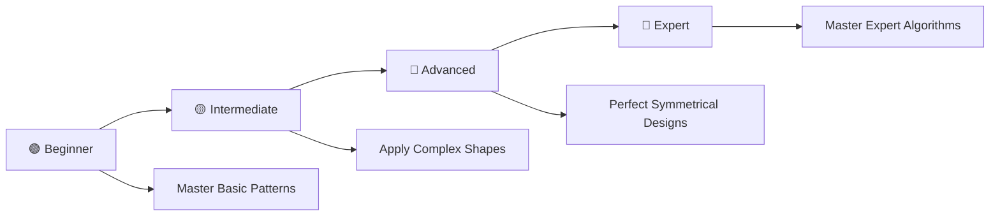

# 🔥 Pattern Printing Mastery: Complete C++ Programming Challenge

> **Master Pattern Programming Through 33 Progressive Problems**

<div align="center">

[](https://en.wikipedia.org/wiki/C_(programming_language))
[](https://github.com/rohit528590/CtoCPP-Journey/tree/main/07_Pattern_Printing_Practice_Problems)
[](https://github.com/rohit528590/CtoCPP-Journey/tree/main/07_Pattern_Printing_Practice_Problems)
[](https://github.com/rohit528590/CtoCPP-Journey/tree/main/07_Pattern_Printing_Practice_Problems)
[](https://github.com/rohit528590/CtoCPP-Journey/tree/main/07_Pattern_Printing_Practice_Problems)

### Welcome to the **Pattern Printing Practice Problems** module of **CtoCPP-Journey**! 🎯


*Master pattern printing through **33 progressive challenges** covering fundamental concepts to advanced algorithms with real-world applications.*

</div>

---

## 📋 Table of Contents

- [📖 Overview](#-overview)
- [🚀 Quick Start](#-quick-start)
- [📚 Problem Categories](#-problem-categories)
- [🔯 Recommended Learning Path](#-recommended-learning-path)
- [🎨 Visual Pattern Showcase](#-visual-pattern-showcase)
- [🎓 What's Next?](#-whats-next)
- [🤝 Resources & Support](#-resources--support)

---

## 📖 Overview

Master **33 progressive pattern printing challenges** in C++ programming. From basic rectangles to complex diamonds, each problem builds essential skills in nested loops, algorithmic thinking, and geometric visualization.

### 🎯 Learning Objectives

- **🔄 Master Nested Loops**: Complex loop structures and control flow
- **🎨 Pattern Recognition**: Geometric shapes and symmetrical designs  
- **🧠 Algorithmic Thinking**: Problem decomposition and logical reasoning
- **💼 Interview Preparation**: Common technical interview patterns
- **⚡ Progressive Mastery**: Beginner-friendly to expert-level challenges

---

## 🚀 Quick Start

### Prerequisites

- Any C++ compiler (GCC, Dev-C++, Code::Blocks)
- Text editor or IDE
- Enthusiasm to learn! 🔥

### Getting Started

```bash
# Clone the repository
git clone https://github.com/rohit528590/CtoCPP-Journey.git

# Change directory
cd CtoCPP-Journey/07_Pattern_Printing_Practice_Problems

# Compile any program
g++ filename.cpp -o output

# Run the program
./output

# Example with Problem 1
g++ 01_Solid_Rectangle.cpp -o solid_rectangle
./solid_rectangle
```

---

## 📚 Problem Categories

### 🟢 **Foundation Level** (Problems 1-11)

*Master the basics of pattern printing*  

| # | 📁 **Problem** | 📊 **Difficulty** | 🔑 **Key Concepts** |
|---|---------|-------------------|--------------------------------------|
| 01 | [Solid Rectangle](01_Solid_Rectangle.cpp) | ⭐ | 🔄 Nested loops and basic shapes |
| 02 | [Solid Square](02_Solid_Square.cpp) | ⭐ | 🔲 Equal dimensions and square logic |
| 03 | [Number Square](03_Number_Square.cpp) | ⭐⭐ | 🔢 Number patterns and data integration |
| 04 | [Star Triangle](04_Star_Triangle.cpp) | ⭐⭐ | 🔺 Variable bounds and triangular shapes |
| 05 | [Inverted Star Triangle](05_Star_Triangle_Ulta.cpp) | ⭐⭐ | 🔻 Reverse logic and decreasing patterns |
| 06 | [Number Triangle](06_Number_Triangle.cpp) | ⭐⭐ | 🔢 Numeric sequences and triangles |
| 07 | [Inverted Number Triangle](07_Number_Triangle_Ulta.cpp) | ⭐⭐ | 🔄 Backward counting and reverse order |
| 08 | [Odd Number Triangle](08_Odd_Number_Triangle.cpp) | ⭐⭐⭐ | 🧮 Arithmetic progressions and odd sequences |
| 09 | [Alphabet Square](09_Alphabet_Square.cpp) | ⭐⭐ | 🔤 Character patterns and ASCII values |
| 10 | [Alphabet Triangle](10_Alphabet_Triangle.cpp) | ⭐⭐ | 🔠 Letter sequences and character incrementing |
| 11 | [Mixed Triangle](11_Alphabet_&_Number_Triangle.cpp) | ⭐⭐⭐ | 🎯 Combined patterns and multiple data types |

**Learning Goals**: Understand basic loop structures, pattern logic, and simple shape creation.

### 🟡 **Intermediate Level** (Problems 12-23)

*Develop advanced pattern recognition and complex algorithms*  

| # | 📁 **Problem** | 📊 **Difficulty** | 🔑 **Key Concepts** |
|---|---------|-------------------|--------------------------------------|
| 12 | [Star Plus](12_Star_Plus.cpp) | ⭐⭐⭐ | ➕ Cross patterns and conditional positioning |
| 13 | [Hollow Rectangle](13_Hollow_Rectangle.cpp) | ⭐⭐⭐ | 🕳️ Hollow shapes and border printing |
| 14 | [Star Cross](14_Star_Cross.cpp) | ⭐⭐⭐ | ❌ Cross patterns and diagonal logic |
| 15 | [Floyd's Triangle](15_Floyd's_Triangle.cpp) | ⭐⭐⭐ | 🔢 Sequential numbering and continuous counting |
| 16 | [Floyd's Triangle 2](16_Floyd's_Triangle2.cpp) | ⭐⭐⭐ | 🔄 Number variations and alternative sequences |
| 17 | [Binary Triangle](17_0_&_1_Triangle.cpp) | ⭐⭐⭐ | 💻 Binary patterns and alternating values |
| 18 | [Star Triangle Mast](18_Star_Triangle_Mast.cpp) | ⭐⭐⭐⭐ | ⭐ Advanced triangles and complex positioning |
| 19 | [Rhombus](19_Rhombus.cpp) | ⭐⭐⭐⭐ | 💎 Diamond shapes and symmetrical patterns |
| 20 | [Alphabet Triangle Mast](20_Alphabet_Triangle_Mast.cpp) | ⭐⭐⭐⭐ | 🔤 Advanced alphabets and positioning |
| 21 | [Star Pyramid](21_Star_Pyramid.cpp) | ⭐⭐⭐⭐ | 🏔️ Pyramid structures and centered alignment |
| 22 | [Number Pyramid](22_Number_Pyramid.cpp) | ⭐⭐⭐⭐ | 🔺 Numeric pyramids and arrangements |
| 23 | [Alphabet Pyramid](23_Alphabet_Pyramid.cpp) | ⭐⭐⭐⭐ | 🔠 Letter pyramids and character sequences |

**Learning Goals**: Master complex algorithms, symmetrical patterns, and advanced positioning techniques.

### 🔴 **Expert Level** (Problems 24-33)

*Tackle the most sophisticated pattern challenges*  

| # | 📁 **Problem** | 📊 **Difficulty** | 🔑 **Key Concepts** |
|---|---------|-------------------|--------------------------------------|
| 24 | [Advanced Number Pyramid](24_Number_Pyramid_Mast.cpp) | ⭐⭐⭐⭐ | 🧮 Complex numbering and sophisticated patterns |
| 25 | [Advanced Alphabet Pyramid](25_Alphabet_Pyramid_Mast.cpp) | ⭐⭐⭐⭐ | 📝 Complex alphabets and advanced lettering |
| 26 | [Star Diamond](26_Star_Diamond.cpp) | ⭐⭐⭐⭐ | 💎 Diamond patterns and dual pyramids |
| 27 | [Advanced Star Pyramid](27_Start_Pyramid_Mast.cpp) | ⭐⭐⭐⭐ | ⭐ Master pyramids and expert-level stars |
| 28 | [Number Pyramid Master](28_Number's_Pyramid_Mast.cpp) | ⭐⭐⭐⭐ | 🔢 Number mastery and complex arrangements |
| 29 | [Alphabet Pyramid Master](29_Alphabeti_Pyramid_Mast.cpp) | ⭐⭐⭐⭐ | 🔤 Alphabet mastery and advanced lettering |
| 30 | [Number Pyramid HW](30_Number_Pyramid_Mast_HW.cpp) | ⭐⭐⭐⭐ | 🎯 Independent problem solving challenges |
| 31 | [Left Triangle Mirror](31_left_triangle_mirror_pattern.cpp) | ⭐⭐⭐⭐ | 🪞 Mirror patterns and reflection algorithms |
| 32 | [Number Mess](32_Number_Mess.cpp) | ⭐⭐⭐⭐ | 🌀 Complex arrangements and intricate patterns |
| 33 | [Number Mess 2](33_Number_Mess_2.cpp) | ⭐⭐⭐⭐ | 🧩 Advanced complexity and master-level challenges |

**Learning Goals**: Master expert-level algorithms, mirror logic, and the most complex pattern arrangements.

---

### 🔯 **Recommended Learning Path**



**💡 Pro Tip**: Progress through each level systematically - master simple patterns before tackling complex pyramids and diamond structures!

---

## 🎨 Visual Pattern Showcase

### 1. Solid Star Square

```cpp
for (int i = 1; i <= n; i++) {                //  Output (for n=4):
    for (int j = 1; j <= n; j++) {            //  * * * * 
        cout<<"* ";                           //  * * * * 
    }                                        //   * * * * 
    cout<<"\n";                              //   * * * * 
}
```

### 2. Number Triangle

```cpp
for (int i = 1; i <= n; i++) {                //  Output (for n=4):
    for (int j = 1; j <= i; j++) {            //  1 
        cout<<j;                              //  1 2 
    }                                        //   1 2 3 
    cout<<"\n";                              //   1 2 3 4 
}
```

### 3. Alphabet Pyramid

```cpp
for (int i = 1; i <= n; i++) {                //  Output (for n=4):
    char ch = 'A';                            //  A 
    for (int j = 1; j <= i; j++) {            //  A B 
        cout<<ch++;                           //  A B C 
    }                                        //   A B C D 
    cout<<"\n";                              //   A B C D E 
}
```

### 4. Hollow Rectangle

```cpp
for (int i = 1; i <= rows; i++) {                             
    for (int j = 1; j <= cols; j++) {
        if (i == 1 || i == rows || j == 1 || j == cols)
            cout<<"* ";
        else
            cout<<"  ";
    }
    cout<<"\n";
}
```

### 5. Mirrored Left Triangle

```cpp
for (int i = 1; i <= n; i++) {
    for (int j = 1; j <= n - i; j++) cout<<"  ";
    for (int k = 1; k <= i; k++) cout<<"* ";
    cout<<"\n";
}
```

---

## 🎓 What's Next?

Ready to level up your C++ programming journey? Here's your personalized learning roadmap:

### 🚀 Immediate Next Challenge

- **⚙️ [Function and Recursion](../08_Function_and_Recursion)** - Master modular programming and recursive algorithms through hands-on practice with 61 comprehensive challenges covering function design, parameter passing, and advanced recursive problem-solving techniques 🔄

### 🌟 Topics Awaiting You

- **Recursion**: Designing recursive functions to solve problems
- **Arrays**: Working with 1D arrays and 2D arrays
- **Pointers**: Manipulating memory using pointers

---

## 🤝 Resources & Support

<div align="center">

| 📚 **Resource Type** | 🔗 **Access Point** | 📝 **Description** |
|---------------------|---------------------|-------------------|
| **🐛 Bug Reports & Questions** | [Open an Issue](https://github.com/rohit528590/CtoCPP-Journey/issues) | Report bugs or ask technical questions |
| **💬 Community Support** | [GitHub Issues](https://github.com/rohit528590/CtoCPP-Journey/issues) | Get help with coding problems and technical questions |
| **🤝 Contribute** | [Fork Repository](https://github.com/rohit528590/CtoCPP-Journey/fork) | Help improve the course for everyone |

</div>

---

<div align="center">

### 🌟 Ready to Master Pattern Printing?

**Choose your starting point and begin your coding journey!**

[](01_Solid_Rectangle.cpp)
[](12_Star_Plus.cpp)
[](24_Number_Pyramid_Mast.cpp)

---

### 💪 Your Structured Learning Path

<div align="center">

```
🟢 Foundation Level      🟡 Intermediate Level      🟠 Advanced Level
   (Problems 1-11)          (Problems 12-23)           (Problems 24-33)
       ↓                        ↓                         ↓
   Basic Patterns      Complex Shapes & Logic    Expert Algorithms
```

**📈 Structured Path:** `Foundation Mastery` → `Complex Design Proficiency` → `Expert Pattern Mastery`

</div>

---

### 🔗 **Support This Project**

<div align="center">

[](https://github.com/rohit528590/CtoCPP-Journey/stargazers)
[](https://github.com/rohit528590/CtoCPP-Journey/network/members)

**⭐ [Star this Repository](https://github.com/rohit528590/CtoCPP-Journey) to show your support!**

</div>

*Happy Coding, future programmer! 🚀👨‍💻👩‍💻*  

</div>

<div align="center">
<sub>Built with ❤️ for C++ programming students | Based on proven learning progression | <a href="https://github.com/rohit528590/CtoCPP-Journey">CtoCPP-Journey Project</a></sub>
</div>
