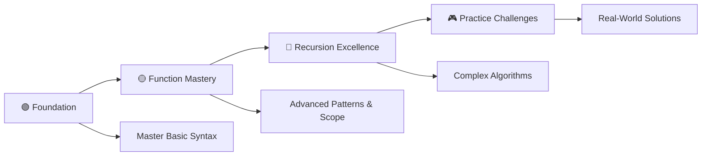

# 🧩 Functions & Recursion in C++ - Complete Learning Guide

<div align="center">

[](https://en.wikipedia.org/wiki/C_(programming_language))
[](https://github.com/rohit528590/CtoCPP-Journey/tree/main/08_Function_and_Recursion)
[](https://github.com/rohit528590/CtoCPP-Journey/tree/main/08_Function_and_Recursion)
[](https://github.com/rohit528590/CtoCPP-Journey/tree/main/08_Function_and_Recursion)
[](https://github.com/rohit528590/CtoCPP-Journey/tree/main/09_Function_Practice_Problems)
[](https://github.com/rohit528590/CtoCPP-Journey/tree/main/10_Recursion_Practice_Problems)

### Welcome to the **Functions & Recursion** module of **CtoCPP-Journey**! 🎯


*A comprehensive, structured journey through C++ programming functions and recursion with hands-on practice, modular programming techniques, and progressive skill development*  

</div>

---

## 📋 Table of Contents

- [🎯 What You'll Master](#-what-youll-master)
- [🚀 Quick Start](#-quick-start)
- [📚 Learning Structure](#-learning-structure)
- [🎮 Practice Challenges](#-practice-challenges)
- [🎯 Recommended Learning Path](#-recommended-learning-path)
- [🔥 Key Concepts with Examples](#-key-concepts-with-examples)
- [🎓 What's Next?](#-whats-next)
- [🤝 Resources & Support](#-resources--support)

---

## 🎯 What You'll Master

<table>
<tr>
<td width="50%" align="center">

### ⚡ **Functions**

*Building blocks of modular programming*  

✅ Function basics & syntax  
✅ Void vs return functions  
✅ Function prototypes  
✅ Variable scope  
✅ Library functions  

</td>
<td width="50%" align="center">

### 🔄 **Recursion**

*Functions that call themselves*  

✅ Direct & indirect recursion  
✅ Base cases & recursive patterns  
✅ Call stack understanding  
✅ Classic algorithms  
✅ Problem-solving techniques  

</td>
</tr>
</table>

---

## 🚀 Quick Start

### 💻 **Get Started in 3 Steps**

```bash
# 1. Clone the repository
git clone https://github.com/rohit528590/CtoCPP-Journey.git

# 2. Change directory
cd CtoCPP-Journey/08_Function_and_Recursion

# 3. Compile your first program
g++ 01_Function.cpp -o my_first_function

# 4. Run and see the magic!
./my_first_function
```

### 📋 **What You Need**

- ✅ Basic C++ knowledge (variables, loops, if-else)
- ✅ Any C++ compiler (GCC, Code::Blocks, Dev-C++)
- ✅ Text editor or IDE
- ✅ Enthusiasm to learn! 🎉

---

## 📚 Learning Structure

### 🌟 **Learning Path: Beginner → Expert**

### 🟢 Phase 1: Foundation

> *Start here if you're new to functions*

| # | 📁 **File** | 📊 **Difficulty** | 🔑 **What You'll Learn** |
|---|------|--------------|------------------|
| 1 | [Function](01_Function.cpp) | ⭐ | 🎯 Your first function |
| 2 | [Function Prototype](02_Function_Prototype.cpp) | ⭐ | 📝 Function declarations |
| 3 | [Function with defination](03_Function_with_defination.cpp) | ⭐ | 🏗️ Complete function structure |
| 4 | [Void Function](04_Void_Function.cpp) | ⭐ | 🔄 Functions without return values |
| 5 | [Non-Void Function](05_Non-Void_Function.cpp) | ⭐ | 📤 Functions that return values |

### 🟡 Phase 2: Advanced Concepts

> *Build deeper understanding*

| # | 📁 **File** | 📊 **Difficulty** | 🔑 **What You'll Learn** |
|---|------|--------------|------------------|
| 6 | [Library Function](06_Library_Function.cpp) | ⭐⭐ | 📚 Using built-in C functions |
| 7 | [C Limits File](07_C_Limits_File.cpp) | ⭐⭐ | ⚖️ Understanding system limits |
| 8 | [Scope Of Variable](08_Scope_Of_Variable.cpp) | ⭐⭐ | 🔍 Variable accessibility rules |
| 9 | [Predicated The Output](09_Predicated_the_output.cpp) | ⭐⭐ | 🧠 Test your knowledge |

### 🔴 Phase 3: Recursion Mastery

> *The most exciting part!*

| # | 📁 **File** | 📊 **Difficulty** | 🔑 **What You'll Learn** |
|---|------|--------------|------------------|
| 10 | [Recursive Function](10_Recursive_Function.cpp) | ⭐⭐⭐ | 🔁 Introduction to recursion |
| 11 | [Direct Recursion](11_Dircet_Recursion.cpp) | ⭐⭐⭐ | ➡️ Function calls itself |
| 12 | [In-direct Recursion](12_In-direct_Recursion.cpp) | ⭐⭐⭐ | 🔄 Functions calling each other |

---

## 🎮 Practice Challenges

### 📁 **Core Function Practice** - [Practice Problem Based on Functions.txt](Practice_Questions_Based_On_Functions.txt)

### 📁 **Recursion Mastery** - [Practice Problem Based on Recursions.txt](Practice_Questions_Based_On_Recursions.txt)

### 🏁 **Start with These Easy Problems**

<details>
<summary><strong>🥇 Level 1: Function Basics (Choose 3-5 to start)</strong></summary>

- [ ] **Simple Calculator** - Functions for +, -, *, /
- [ ] **Temperature Converter** - Celsius ↔ Fahrenheit
- [ ] **Grade Calculator** - Input marks, return grade
- [ ] **Area Calculator** - Circle, rectangle, triangle
- [ ] **Even/Odd Checker** - Function to check numbers
- [ ] **Age Calculator** - Calculate age from birth year

</details>

<details>
<summary><strong>🥈 Level 2: Intermediate Functions</strong></summary>

- [ ] **Password Validator** - Check strength requirements
- [ ] **Prime Number Checker** - Function to test primes
- [ ] **Factorial Calculator** - Using loops in functions
- [ ] **Number Pattern Printer** - Functions for patterns
- [ ] **String Utilities** - Length, reverse, compare

</details>

<details>
<summary><strong>🥉 Level 3: Recursion Challenges</strong></summary>

- [ ] **Fibonacci Sequence** - Classic recursion problem
- [ ] **Sum of Digits** - Add all digits in a number
- [ ] **Tower of Hanoi** - Famous puzzle problem
- [ ] **Binary Search** - Searching in sorted arrays
- [ ] **Tree Traversal** - Navigate tree structures

</details>

---

## 🎯 **Recommended Learning Path**



**💡 Pro Tip**: Progress systematically through each phase - master functions before recursion, then apply skills with challenging practice problems!

---

## 🔥 Key Concepts with Examples

### 1. Void Function

```cpp
void greet() {
    cout<<"Hello, World!\n";
}
// Usage:
greet();
```

### 2. Non-Void Function (with Return Value)

```cpp
int add(int a, int b) {
    return a + b;
}
// Usage:
int sum = add(3, 5);
cout<<"Sum: "<<sum<<endl;
```

### 3. Function Prototype

```cpp
int multiply(int, int); // Prototype
int main() {
    cout<<multiply(2, 4)<<endl;
}
int multiply(int x, int y) {
    return x * y;
}
```

### 4. Scope of Variables

```cpp
int globalVar = 10;
void showScope() {
    int localVar = 5;
    cout<<"Global: "<<globalVar<<", Local: "<<localVar<<endl;
}
```

### 5. Using a Library Function

```cpp
#include <math.h>
double root = sqrt(16.0);
cout<<"Square root: "<<root<<endl;
```

### 6. Direct Recursion

```cpp
int factorial(int n) {
    if (n == 0) return 1; // Base case
    return n * factorial(n - 1); // Recursive case
}
cout<<factorial(5)<<endl;
```

### 7. Indirect Recursion

```cpp
void funA(int n);
void funB(int n);
void funA(int n) {
    if (n > 0) {
        cout<<n<<" ";
        funB(n - 1);
    }
}
void funB(int n) {
    if (n > 1) {
        cout<<n<<" ";
        funA(n / 2);
    }
}
// Usage:
funA(5);
```

---

## 🎓 What's Next?

Ready to level up your C++ programming journey? Here's your personalized learning roadmap:

### 🚀 Immediate Next Challenge

- **[🔄 Function Practice Problems](../09_Function_Practice_Problems)** - Master modular programming through 30+ hands-on challenges covering function design, parameter passing, return values, and scope management with complete solutions

- **[🎨 Recursion Practice Problems](../10_Recursion_Practice_Problems)** - Master recursive thinking with progressive challenges from basic patterns to advanced algorithms including factorial, Fibonacci, and tree traversal with detailed solutions

### 🌟 Topics Awaiting You

- **📊 Data Structures**: Array, 2D Array, Stacks, Queues
- **🔁 Pointers**: Creating pointers using functions, Dynamic memory allocation, Pointer arithmetic
- **🌌 Advanced Recursion**: Tree traversal, Dynamic programming, Memoization

---

## 🤝 Resources & Support

| 📚 **Resource Type** | 🔗 **Access Point** | 📝 **Description** |
|---------------------|---------------------|-------------------|
| **⚙️ Function Practice Problems** | [Function Practice Problems.txt](Practice_Questions_Based_On_Functions.txt) | 50+ function challenges to master iteration concepts |
| **🔁 Recursion Practice** | [Recursion Practice Problems.txt](Practice_Questions_Based_On_Recursions.txt) | 40+ recursive challenges to master recursion concepts |
| **🐛 Bug Reports & Questions** | [Open an Issue](https://github.com/rohit528590/CtoCPP-Journey/issues) | Report bugs or ask technical questions |
| **💬 Community Support** | [GitHub Issues](https://github.com/rohit528590/CtoCPP-Journey/issues) | Get help with coding problems and technical questions |
| **🤝 Contribute** | [Fork Repository](https://github.com/rohit528590/CtoCPP-Journey/fork) | Help improve the course for everyone |

---

<div align="center">

## 🚀 Ready to Master C++ Functions & Recursion?

**Follow the exact progression from your carefully crafted examples!**

[](01_Function.cpp)
[](10_Recursive_Function.cpp)
[](Practice_Questions_Based_On_Recursions.txt)

### 🌟 **Remember:**

*Every expert programmer started exactly where you are now. The key is consistent practice and curiosity to learn!*

---

### 💪 Your Structured Learning Path

<div align="center">

```
🟢 Foundation Phase      🟡 Recursion Mastery      🔴 Advanced Applications
   (Files 01-06)          (Files 07-11)             (50+ Practice Problems)
       ↓                       ↓                         ↓
   Function Fundamentals   Recursive Algorithms    Professional Programming
```

**📈 Progressive Journey:** `Function Basics` → `Recursion Mastery` → `Algorithm Excellence`

</div>

---

### 🔗 **Support This Project**

[](https://github.com/rohit528590/CtoCPP-Journey/stargazers)
[](https://github.com/rohit528590/CtoCPP-Journey/network/members)

**⭐ [Star this Repository](https://github.com/rohit528590/CtoCPP-Journey) to show your support!**

*Happy Coding, future programmer! 🚀👨‍💻👩‍💻*  

<sub>Built with ❤️ for C++ programming students | Based on proven learning progression | <a href="https://github.com/rohit528590/CtoCPP-Journey">CtoCPP-Journey Project</a></sub>
</div>
