# 🛠️ Function Mastery: Complete C++ Programming Challenge

> **Master Functions Through 36 Progressive Programming Problems**

<div align="center">

[](https://en.wikipedia.org/wiki/C_(programming_language))
[](https://github.com/rohit528590/CtoCPP-Journey/tree/main/09_Function_Practice_Problems)
[](https://github.com/rohit528590/CtoCPP-Journey/tree/main/09_Function_Practice_Problems)
[](https://github.com/rohit528590/CtoCPP-Journey/tree/main/09_Function_Practice_Problems)
[](https://github.com/rohit528590/CtoCPP-Journey/tree/main/09_Function_Practice_Problems)

### Welcome to the **Function Practice Problems** module of **CtoCPP-Journey**! 🎯


*Master functions through **36 progressive challenges** covering fundamental concepts to advanced algorithms with real-world applications.*

</div>

---

## 📋 Table of Contents

- [📖 Overview](#-overview)
- [⚡ Quick Start Guide](#-quick-start-guide)
- [📚 Problem Categories](#-problem-categories)
- [🎯 Recommended Learning Path](#-recommended-learning-path)
- [🖥️ Essential Function Examples](#️-essential-function-examples)
- [🎓 What's Next?](#-whats-next)
- [🤝 Resources & Support](#-resources--support)

---

## 📖 Overview

Master **36 progressive function challenges** covering essential C++ programming concepts:

### 🎯 **Core Learning Areas**

- **📊 Mathematical Operations**: Basic arithmetic, statistics, and number theory
- **🔢 Algorithm Implementation**: Prime detection, sequences, and combinatorics  
- **📐 Scientific Computing**: Geometry, conversions, and mathematical functions
- **🔄 Data Processing**: Comparisons, swapping, and logical operations
- **🛠️ Professional Practices**: Library usage, modular design, and code optimization

Transform theoretical knowledge into practical programming skills through hands-on problem solving.

---

## ⚡ Quick Start Guide

### Prerequisites

- Any C++ compiler (g++, Dev-C++, Code::Blocks)
- Text editor or IDE
- Enthusiasm to learn! 🔥

### Getting Started

```bash
# Clone the repository
git clone https://github.com/rohit528590/CtoCPP-Journey.git

# Change directory
cd CtoCPP-Journey/09_Function_Practice_Problems

# Compile any program
g++ filename.cpp -o output

# Run the program
./output

# Example with Problem 1
g++ 01_Good_Morning_Afternoon.cpp -o good_morning_afternoon
./good_morning_afternoon
```

---

## 📚 Problem Categories

### 🟢 **Foundation Level** (Problems 1-13)

*Build your function fundamentals with essential concepts*  

| # | 📁 **Problem** | 📊 **Difficulty** | 🔑 **Key Concepts & Learning Focus** |
|---|---------|-------------------|--------------------------------------|
| 01 | [Good Morning Afternoon](01_Good_Morning_Afternoon.cpp) | ⭐ | 🌅 Basic void functions and greeting logic |
| 02 | [Namaste and Bonjour](02_Namaste_and_Bonjour.cpp) | ⭐ | 🌍 Multi-language functions and string handling |
| 03 | [Table Of N](03_Table_Of_N.cpp) | ⭐ | 📊 Loop integration with functions |
| 04 | [Hot Cold](04_Hot_Cold.cpp) | ⭐⭐ | 🌡️ Conditional functions and temperature logic |
| 05 | [Sum of Three Numbers](05_Sum_of_three_numbers.cpp) | ⭐ | ➕ Parameter passing and return values |
| 06 | [Sum Product Average](06_Sum_Product_Average.cpp) | ⭐⭐ | 🧮 Multiple calculations in single function |
| 07 | [Area Of Square](07_Area_Of_Square.cpp) | ⭐ | 🔲 Geometric calculations and math functions |
| 08 | [Celsius to Fahrenheit](08_Celsius_to_Fahreheit.cpp) | ⭐⭐ | 🌡️ Temperature conversion formulas |
| 09 | [Celsius to Kelvin](09_Celsius_to_Kelvin.cpp) | ⭐⭐ | ❄️ Scientific temperature scales |
| 10 | [Fahrenheit to Celsius](10_Fahrenheit_to_Celsius.cpp) | ⭐⭐ | 🔄 Reverse conversion logic |
| 11 | [Fahrenheit to Kelvin](11_Fahrenheit_to_Kelvin.cpp) | ⭐⭐ | 🔥 Multi-step temperature conversions |
| 12 | [Kelvin to Celsius](12_Kelvin_to_Celsius.cpp) | ⭐⭐ | 🧊 Absolute temperature handling |
| 13 | [Kelvin to Fahrenheit](13_Kelvin_to_Fahreheit.cpp) | ⭐⭐ | ⚡ Complex formula implementation |

**🎯 Focus Areas:** Function basics, parameter passing, return values, simple calculations

---

### 🟡 **Intermediate Level** (Problems 14-25)

*Develop analytical thinking and optimization skills*  

| # | 📁 **Problem** | 📊 **Difficulty** | 🔑 **Key Concepts & Learning Focus** |
|---|---------|-------------------|--------------------------------------|
| 14 | [Min of Two Numbers](14_Min_of_two_numbers.cpp) | ⭐⭐ | 🔍 Comparison functions and conditional returns |
| 15 | [Min of Three Numbers](15_Min_of_three_numbers.cpp) | ⭐⭐ | 🎯 Multiple parameter comparison logic |
| 16 | [Area Of Circle Rectangle](16_Area_Of_Circle,Rectangle.cpp) | ⭐⭐ | 📐 Multiple geometric functions |
| 17 | [Force Of Attraction](17_Force_Of_Attraction.cpp) | ⭐⭐⭐ | 🪐 Physics formulas and scientific computing |
| 18 | [Factorial](18_Factorial.cpp) | ⭐⭐ | 🔢 Recursive thinking and mathematical functions |
| 19 | [Factorial of First N](19_Factorial_of_First_N.cpp) | ⭐⭐⭐ | 🔄 Loop-function integration and series |
| 20 | [Fibonacci](20_Fibonacci.cpp) | ⭐⭐⭐ | 🌀 Sequence generation and algorithm design |
| 21 | [Fibonacci of First N](21_Fibonacci_of_First_N.cpp) | ⭐⭐⭐ | 📈 Series processing and optimization |
| 22 | [Sum Of Digit Of N](22_Sum_Of_Digit_Of_N.cpp) | ⭐⭐ | 🔤 Digit extraction and number manipulation |
| 23 | [Right Star Triangle](23_Right_Start_Triangle.cpp) | ⭐⭐ | ⭐ Pattern functions and nested loops |
| 24 | [Combination](24_Combination.cpp) | ⭐⭐⭐ | 🎲 Combinatorics and mathematical formulas |
| 25 | [Permutation](25_Permutation.cpp) | ⭐⭐⭐ | 🔀 Permutation algorithms and factorial usage |

**🎯 Focus Areas:** Algorithm implementation, mathematical functions, pattern generation, optimization

---

### 🔴 **Advanced Level** (Problems 26-36)

*Master advanced function concepts and real-world applications*  

| # | 📁 **Problem** | 📊 **Difficulty** | 🔑 **Key Concepts & Learning Focus** |
|---|---------|-------------------|--------------------------------------|
| 26 | [Star Pascal Triangle](26_Star_Pascal_Triangle.cpp) | ⭐⭐⭐ | 🔺 Advanced pattern generation |
| 27 | [Center-align Pascal Triangle](27_Center-align_rows_Pascal_Triangle.cpp) | ⭐⭐⭐⭐ | 🎯 Alignment algorithms and spacing |
| 28 | [Swap Numbers Using Temp](28_Print_Swap_Numbers_Using_Temp.cpp) | ⭐⭐ | 🔄 Variable swapping and temporary storage |
| 29 | [Swap Numbers](29_Printing_Swap_Numbers.cpp) | ⭐⭐⭐ | ⚡ Advanced swapping without temp variables |
| 30 | [Power Library Function](30_Power_Library_Function.cpp) | ⭐⭐ | 📚 Library function usage and math.h |
| 31 | [Power Function](31_Power_Function.cpp) | ⭐⭐⭐ | 💪 Custom power implementation |
| 32 | [Power From 0 to Exponent](32_Power_From_0_to_Exponet.cpp) | ⭐⭐⭐ | 📊 Power series and mathematical sequences |
| 33 | [Greatest Common Divisor](33_Greatest_Common_Divisor.cpp) | ⭐⭐⭐⭐ | 🔍 Euclidean algorithm and number theory |
| 34 | [Prime Factors Of N](34_Prime_Factors_Of_N.cpp) | ⭐⭐⭐⭐ | 🔢 Prime factorization and advanced algorithms |
| 35 | [Square Root](35_Square_root.cpp) | ⭐⭐⭐⭐ | 📐 Numerical methods and precision handling |
| 36 | [Prime Numbers In Range](36_Prime_Numbers_In_Range.cpp) | ⭐⭐⭐⭐ | 🎯 Sieve algorithms and optimization techniques |

**🎯 Focus Areas:** Advanced algorithms, number theory, mathematical optimization, computational efficiency

---

### 🎯 **Recommended Learning Path**

```mermaid
graph LR
    A[🟢 Foundation] --> B[🟡 Intermediate]
    B --> C[🔴 Advanced]
    A --> D[Master Basic Functions]
    B --> E[Apply Mathematical Concepts]
    C --> F[Perfect Complex Algorithms]
```



**💡 Pro Tip**: Complete problems in sequence for optimal skill building!

---

## 🖥️ Essential Function Examples

### 1. Basic Function (No Return Value)

```cpp
void greet() {
    cout<<"Hello, World!\n";
}
// Usage:
greet();
```

### 2. Function with Return Value

```cpp
int add(int a, int b) {
    return a + b;
}
// Usage:
int sum = add(3, 5);
cout<<"Sum: "<<sum<<endl;
```

### 3. Passing Parameters by Value

```cpp
void printSquare(int n) {
    cout<<"Square: "<<n*n<<endl;
}
printSquare(4);
```

### 4. Composite Functions

```cpp
int multiply(int a, int b) {
    return a * b;
}
int squareOfSum(int x, int y) {
    int s = add(x, y);
    return multiply(s, s);
}
cout<<squareOfSum(2, 3)<<endl;
```

### 5. Using a Library Function

```cpp
#include <math.h>
double root = sqrt(25.0);
cout<<"Square root: "<<root<<endl;
```

---

## 🎓 What's Next?

Ready to level up your C++ programming journey? Here's your personalized learning roadmap:

### 🚀 Immediate Next Challenge

- **🔁 [Recursion Practice Problems](../10_Recursion_Practice_Problems)** - Master recursive algorithms through 25 comprehensive challenges covering base cases, recursive calls, call stack understanding, and advanced recursive problem-solving techniques 🌀

### 🌟 Topics Awaiting You

- **📊 Data Structures: Arrays & 2D Arrays** - Master single and multi-dimensional arrays, memory layout, indexing, and matrix operations
- **🎯 Pointers & Memory Management** - Direct memory access, pointer arithmetic, and dynamic memory allocation
- **🔗 Advanced Pointer Concepts** - Multi-level pointers, pointer-to-pointer relationships, and complex data structure navigation

---

## 🤝 Resources & Support

<div align="center">

| 📚 **Resource Type** | 🔗 **Access Point** | 📝 **Description** |
|---------------------|---------------------|-------------------|
| **🐛 Bug Reports & Questions** | [Open an Issue](https://github.com/rohit528590/CtoCPP-Journey/issues) | Report bugs or ask technical questions |
| **💬 Community Support** | [GitHub Issues](https://github.com/rohit528590/CtoCPP-Journey/issues) | Get help with coding problems and technical questions |
| **🤝 Contribute** | [Fork Repository](https://github.com/rohit528590/CtoCPP-Journey/fork) | Help improve the course for everyone |

</div>

---

<div align="center">

### 🌟 Ready to Master Functions?

**Choose your starting point and begin your coding journey!**

[](01_Good_Morning_Afternoon.cpp)
[](14_Min_of_two_numbers.cpp)
[](26_Star_Pascal_Triangle.cpp)

---

### 💪 Your Structured Learning Path

<div align="center">

```
🟢 Foundation Level      🟡 Intermediate Level      🟠 Advanced Level
   (Problems 1-13)          (Problems 14-25)           (Problems 26-36)
       ↓                        ↓                         ↓
   Basic Functions    Parameter Passing & Return    Modular Programming
```

**📈 Structured Path:** `Function Fundamentals` → `Parameter Mastery` → `Advanced Function Design`

</div>

---

### 🔗 **Support This Project**

<div align="center">

[](https://github.com/rohit528590/CtoCPP-Journey/stargazers)
[](https://github.com/rohit528590/CtoCPP-Journey/network/members)

**⭐ [Star this Repository](https://github.com/rohit528590/CtoCPP-Journey) to show your support!**

</div>

*Happy Coding, future programmer! 🚀👨‍💻👩‍💻*  

</div>

<div align="center">
<sub>Built with ❤️ for C++ programming students | Based on proven learning progression | <a href="https://github.com/rohit528590/CtoCPP-Journey">CtoCPP-Journey Project</a></sub>
</div>
