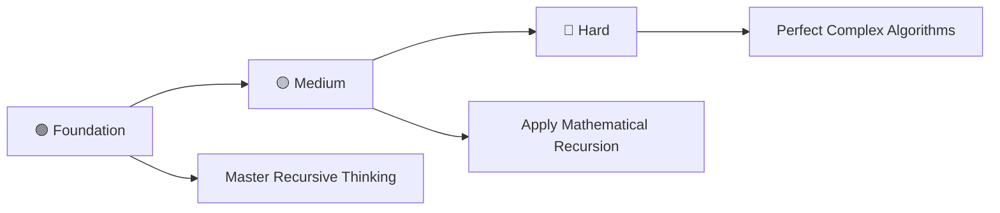

# 🔁 Recursion Practice Problems in C++

> **Master Recursion Through 25 Progressive Programming Problems**

<div align="center">

[](https://en.wikipedia.org/wiki/C_(programming_language))
[](https://github.com/rohit528590/CtoCPP-Journey/tree/main/10_Recursion_Practice_Problems)
[](https://github.com/rohit528590/CtoCPP-Journey/tree/main/10_Recursion_Practice_Problems)
[](https://github.com/rohit528590/CtoCPP-Journey/tree/main/10_Recursion_Practice_Problems)
[](https://github.com/rohit528590/CtoCPP-Journey/tree/main/10_Recursion_Practice_Problems)

### Welcome to the **Recursion Practice Problems** module of **CtoCPP-Journey**! 🎯


*Master Recursion through **25 progressive challenges** covering fundamental concepts to advanced algorithms with real-world applications.*

</div>

---

## 📖 Overview

Master **25 progressive recursion challenges** covering essential recursive programming concepts:

### 🎯 **Core Learning Areas**

- **🔄 Recursive Fundamentals**: Base cases, recursive calls, and stack understanding
- **🔢 Mathematical Recursion**: Factorial, Fibonacci, power calculations, and number theory
- **📊 Sequence Generation**: Series calculations, digit manipulation, and pattern recognition
- **🧮 Combinatorial Problems**: Permutations, combinations, and advanced mathematical operations
- **🎯 Algorithm Mastery**: Tree traversal concepts, optimization techniques, and recursive thinking

Transform theoretical recursion knowledge into practical programming expertise through systematic problem-solving.

---

## 📚 Problem Categories

### 🟢 **Foundation Level** (Problems 1-9)

*Build your recursion fundamentals with essential concepts*  

| #  | 📁 **Problem**                                         | 📊 **Difficulty** | 🔑 **Key Concepts** |
|----|---------------------------------------------------|-------------------|---------------------|
| 1  | [Hellow World N Times](01_Hellow_World_N_Times.cpp)      | ⭐ | 🔄 Basic recursion and base cases |
| 2  | [Factorial](02_Factorial.cpp)                 | ⭐ | ➗ Mathematical recursion and return values |
| 3  | [Factorial of first n recursively](03_Factorial_of_first_n_recersively.cpp) | ⭐⭐ | 🔢 Loop-recursion integration and series |
| 4  | [Decreasing order of n](04_Decreasing_order_of_n.cpp)     | ⭐ | ⬇️ Decreasing sequence and call stack |
| 5  | [Print decreasing number in range](05_Print_decreasing_number_in_range.cpp) | ⭐⭐ | 📏 Range handling and recursive printing |
| 6  | [Print 1 to N Parameteriased](06_Print_1_to_N_Parameteriased.cpp) | ⭐⭐ | 📊 Parameterized recursion techniques |
| 7  | [Print increasing number in range](07_Print_increasing_number_in_range.cpp) | ⭐⭐ | ⬆️ Increasing sequence and call ordering |
| 8  | [Print 1 to N after call](08_Print_1_to_N_after_call.cpp)   | ⭐⭐ | 🔄 Post-call execution and stack unwinding |
| 9  | [Relationship of Increasing Decreasing](09_Relatioship_of_Increasing_decreasing.cpp) | ⭐⭐⭐ | 🔀 Call stack behavior and execution order |

---

### 🟡 **Medium Recursion Problems** (Problems 10-17)

*Develop analytical thinking and optimization skills*  

| #  | 📁 **Problem**                                         | 📊 **Difficulty** | 🔑 **Key Concepts** |
|----|---------------------------------------------------|-------------------|---------------------|
| 10 | [Sum of first n recursively](10_Sum_of_first_n_recersively.cpp) | ⭐⭐ | ➕ Accumulation and recursive summation |
| 11 | [Sum From Start to End Parameterasied](11_Sum_From_Start_to_End-Parameterasied.cpp) | ⭐⭐⭐ | 🎯 Parameterized range operations |
| 12 | [Sum From Start to End](12_Sum_from_Start_to_End.cpp)     | ⭐⭐ | 📏 Range-based recursive calculations |
| 13 | [Raised to the power](13_Raised_to_the_power.cpp)       | ⭐⭐⭐ | ⚡ Exponential recursion and mathematical functions |
| 14 | [N term of fibonacci](14_N_term_of_fibonacci.cpp)       | ⭐⭐⭐ | 🌀 Fibonacci sequence and multiple recursive calls |
| 15 | [Sum of factorial](15_Sum_of_factorial.cpp)          | ⭐⭐⭐ | 🧮 Combined factorial and summation logic |
| 16 | [First Fibonacci Sequence](16_First_Fibonacci_Sequence.cpp)  | ⭐⭐⭐ | 📈 Fibonacci series generation and optimization |
| 17 | [Sum Of Fibonacci Sequence](17_Sum_Of_Fibonacci_Sequence.cpp) | ⭐⭐⭐ | 🔢 Fibonacci summation and series processing |

---

### 🔴 **Hard Recursion Problems** (Problems 18-25)

*Master advanced recursion concepts and real-world applications*  

| #  | 📁 **Problem**                                         | 📊 **Difficulty** | 🔑 **Key Concepts** |
|----|---------------------------------------------------|-------------------|---------------------|
| 18 | [Stair Path-1](18_Stair_Path-1.cpp)              | ⭐⭐⭐ | 🪜 Dynamic programming and path counting |
| 19 | [Stair Path-2](19_Stair_Path-2.cpp)              | ⭐⭐⭐⭐ | 🎯 Multi-way recursion and combinatorial problems |
| 20 | [Optimised Rasied Power](20_Optimised_Rasied_Power.cpp)    | ⭐⭐⭐⭐ | ⚡ Logarithmic optimization and efficient recursion |
| 21 | [Maze Path-parameterised](21_Maze_Path-parameterised.cpp)   | ⭐⭐⭐⭐ | 🗺️ Grid navigation and parameterized pathfinding |
| 22 | [Maze Path](22_Maze_Path.cpp)                 | ⭐⭐⭐ | 🧭 2D recursion and directional movement |
| 23 | [Pre In Post](23_Pre_In_Post.cpp)               | ⭐⭐⭐⭐ | 🌳 Tree traversal patterns and recursive execution order |
| 24 | [Zig Zag](24_Zig_Zag.cpp)                   | ⭐⭐⭐⭐⭐ | 🔀 Complex recursive patterns and directional logic |
| 25 | [Tower of Hanoi](25_Tower_of_Hanol.cpp)            | ⭐⭐⭐⭐⭐ | 🗼 Classic recursive algorithm and problem decomposition |

---

### 🎯 **Recommended Learning Path**



**💡 Pro Tip**: Start with simple base cases, then progress to multi-branch recursion and optimization techniques!

---

## 🖥️ Classic Recursion Examples

### 1. Factorial (Recursive)

```cpp
int factorial(int n) {
    if (n == 0) return 1; // Base case
    return n * factorial(n - 1); // Recursive case
}
cout<<factorial(5)<<endl;
```

### 2. Fibonacci (Nth Term)

```cpp
int fibonacci(int n) {
    if (n == 0) return 0;
    if (n == 1) return 1;
    return fibonacci(n - 1) + fibonacci(n - 2);
}
cout<<fibonacci(6)<<endl;
```

### 3. Sum of First N Natural Numbers

```cpp
int sumN(int n) {
    if (n == 1) return 1;
    return n + sumN(n - 1);
}
cout<<sumN(10)<<endl;
```

### 4. Print Numbers in Increasing Order

```cpp
void printIncreasing(int n) {
    if (n == 0) return;
    printIncreasing(n - 1);
    cout<<n<<" ";
}
printIncreasing(5); // Output: 1 2 3 4 5
```

### 5. Tower of Hanoi (Moves)

```cpp
void towerOfHanoi(int n, char from, char to, char aux) {
    if (n == 0) return;
    towerOfHanoi(n - 1, from, aux, to);
    cout<<"Move disk "<<n<<" from "<<from<<" to "<<to<<endl;
    towerOfHanoi(n - 1, aux, to, from);
}
towerOfHanoi(3, 'A', 'C', 'B');
```

---

## 🎓 What's Next?

Ready to level up your C++ programming journey? Here's your personalized learning roadmap:

### 🚀 Immediate Next Challenge

- **🔁 [Data Structures: Array and 2D Array](../11_Array_and_2D-Array)** - Master recursive algorithms through 25 comprehensive challenges covering base cases, recursive calls, call stack understanding, and advanced recursive problem-solving techniques 🌀

### 🌟 Topics Awaiting You

- **🎯 Pointers & Memory Management** - Direct memory access, pointer arithmetic, and dynamic memory allocation
- **🔗 Advanced Pointer Concepts** - Multi-level pointers, pointer-to-pointer relationships, and complex data structure navigation

---

## 🤝 Resources & Support

<div align="center">

| 📚 **Resource Type** | 🔗 **Access Point** | 📝 **Description** |
|---------------------|---------------------|-------------------|
| **🐛 Bug Reports & Questions** | [Open an Issue](https://github.com/rohit528590/CtoCPP-Journey/issues) | Report bugs or ask technical questions |
| **💬 Community Support** | [GitHub Issues](https://github.com/rohit528590/CtoCPP-Journey/issues) | Get help with coding problems and technical questions |
| **🤝 Contribute** | [Fork Repository](https://github.com/rohit528590/CtoCPP-Journey/fork) | Help improve the course for everyone |

</div>

---

<div align="center">

### 🌟 Ready to Master Recursion?

**Choose your starting point and begin your coding journey!**

[](01_Hellow_World_N_Times.cpp)
[](10_Sum_of_first_n_recersively.cpp)
[](18_Stair_Path-1.cpp)

---

### 💪 Your Structured Learning Path

<div align="center">

```
🟢 Foundation Level      🟡 Medium Level      🔴 Hard Level
   (Problems 1-9)          (Problems 10-17)           (Problems 18-25)
       ↓                        ↓                         ↓
   Recursive Fundamentals    Mathematical Recursion    Complex Algorithms
```

**📈 Structured Path:** `Base Cases & Calls` → `Mathematical Applications` → `Advanced Problem Solving`

</div>

---

### 🔗 **Support This Project**

<div align="center">

[](https://github.com/rohit528590/CtoCPP-Journey/stargazers)
[](https://github.com/rohit528590/CtoCPP-Journey/network/members)

**⭐ [Star this Repository](https://github.com/rohit528590/CtoCPP-Journey) to show your support!**

</div>

*Happy Coding, future programmer! 🚀👨‍💻👩‍💻*  

</div>

<div align="center">
<sub>Built with ❤️ for C++ programming students | Based on proven learning progression | <a href="https://github.com/rohit528590/CtoCPP-Journey">CtoCPP-Journey Project</a></sub>
</div>
