# 🛠️ Array Mastery: Complete C++ Programming Challenge

> **Master Arrays Through 27 Progressive Programming Problems**

<div align="center">

[](https://en.wikipedia.org/wiki/C_(programming_language))
[](https://github.com/rohit528590/CtoCPP-Journey/tree/main/12_Array_Practice_Problems)
[](https://github.com/rohit528590/CtoCPP-Journey/tree/main/12_Array_Practice_Problems)
[](https://github.com/rohit528590/CtoCPP-Journey/tree/main/12_Array_Practice_Problems)
[](https://github.com/rohit528590/CtoCPP-Journey/tree/main/12_Array_Practice_Problems)

### Welcome to the **Array Practice Problems** module of **CtoCPP-Journey**! 🎯


*Master arrays through **27 progressive challenges** covering fundamental concepts to advanced algorithms with real-world applications.*

</div>

---

## 📋 Table of Contents

- [📖 Overview](#-overview)
- [⚡ Quick Start Guide](#-quick-start-guide)
- [📚 Problem Categories](#-problem-categories)
- [🎯 Recommended Learning Path](#-recommended-learning-path)
- [🖥️ Essential Array Examples](#️-essential-array-examples)
- [🎓 What's Next?](#-whats-next)
- [🤝 Resources & Support](#-resources--support)

---

## 📖 Overview

Master **27 progressive array challenges** covering essential C++ programming concepts:

### 🎯 **Core Learning Areas**

- **📊 Array Fundamentals**: Declaration, initialization, and basic operations
- **🔢 Mathematical Operations**: Sum, product, max/min calculations  
- **🔍 Search & Analysis**: Element finding, counting, and pattern detection
- **🔄 Data Manipulation**: Reversing, rotating, swapping, and copying arrays
- **🛠️ Advanced Algorithms**: Two-sum, missing numbers, duplicates, and palindromes

Transform theoretical knowledge into practical programming skills through hands-on problem solving.

---

## ⚡ Quick Start Guide

### Prerequisites

- Any C++ compiler (GCC, Dev-C++, Code::Blocks)
- Text editor or IDE
- Enthusiasm to learn! 🔥

### Getting Started

```bash
# Clone the repository
git clone https://github.com/rohit528590/CtoCPP-Journey.git

# Change directory
cd CtoCPP-Journey/12_Array_Practice_Problems

# Compile any program
g++ filename.cpp -o output

# Run the program
./output

# Example with Problem 1
g++ 01_Student_Below_Pass_Mark.cpp -o student_marks
./student_marks
```

---

## 📚 Problem Categories

### 🟢 **Foundation Level** (Problems 1-8)

*Build your array fundamentals with essential concepts*  

| # | 📝 **Problem** | 📊 **Difficulty** | 🔑 **Key Concepts & Learning Focus** |
|---|---------|-------------------|--------------------------------------|
| 01 | [Students Below Pass Mark](01_Student_Below_Pass_Mark.cpp) | ⭐ | 📋 Array traversal and conditional processing |
| 02 | [Sum of Array Elements](02_Sum_of_Array.cpp) | ⭐ | ➕ Basic accumulation and array processing |
| 03 | [Product of Array Elements](03_Product_of_Array.cpp) | ⭐ | ✖️ Multiplicative operations and overflow handling |
| 04 | [Multiplication Table Storage](04_Storing_multiplication_of_n.cpp) | ⭐⭐ | 📊 Systematic array population and data generation |
| 05 | [Find Maximum Element](05_Find_max_in_array.cpp) | ⭐ | 🔍 Linear search and comparison algorithms |
| 06 | [Maximum using C-Limits](06_Maximum_in_array_using_C-Limits.cpp) | ⭐⭐ | 📚 Standard library usage and efficient initialization |
| 07 | [Find Minimum Element](07_Minimum_Value_In_Array.cpp) | ⭐ | 🎯 Min-finding algorithms and optimization |
| 08 | [Minimum using C-Limits](08_MIn_of_Array_using_C-Limits.cpp) | ⭐⭐ | 💡 Library optimization and best practices |

**🎯 Focus Areas:** Array basics, input/output, simple algorithms, library usage

---

### 🟡 **Intermediate Level** (Problems 9-16)

*Develop analytical thinking and optimization skills*  

| # | 📝 **Problem** | 📊 **Difficulty** | 🔑 **Key Concepts & Learning Focus** |
|---|---------|-------------------|--------------------------------------|
| 09 | [Even-Odd Index Operations](09_Even_odd_element_changes.cpp) | ⭐⭐ | 🔄 Index-based logic and position-dependent processing |
| 10 | [Count Elements Greater Than X](10_Count_element_greater_than_x.cpp) | ⭐⭐ | 🔢 Conditional counting and threshold algorithms |
| 11 | [Even-Odd Index Sum Difference](11_difference_even_odd_index_sum.c) | ⭐⭐⭐ | 🧮 Mathematical analysis and index-based calculations |
| 12 | [Two Sum Problem](12_Sum_pairs_equal_to_x.cpp) | ⭐⭐⭐ | 🎯 Pair finding and nested loop optimization |
| 13 | [Triplet Sum Problem](13_Triplet_sum_pair_equal_to_x.cpp) | ⭐⭐⭐⭐ | 🔍 Triple combinations and complex search algorithms |
| 14 | [Fibonacci Sequence Storage](14_Storing_N_Fibonacci.cpp) | ⭐⭐ | 🌀 Sequence generation and mathematical series |
| 15 | [Second Maximum Element](15_Second_Max.cpp) | ⭐⭐⭐ | 📈 Advanced searching and multi-pass algorithms |
| 16 | [Optimized Second Maximum](16_Optimise_second_max.cpp) | ⭐⭐⭐ | ⚡ Single-pass efficiency and algorithm optimization |

**🎯 Focus Areas:** Complex searching, mathematical operations, algorithm optimization, nested loops

---

### 🔴 **Advanced Level** (Problems 17-27)

*Master advanced array concepts and real-world applications*  

| # | 📝 **Problem** | 📊 **Difficulty** | 🔑 **Key Concepts & Learning Focus** |
|---|---------|-------------------|--------------------------------------|
| 17 | [Print Array in Reverse](17_Print_Reverse_Order.cpp) | ⭐⭐ | 🔄 Reverse traversal and backward iteration |
| 18 | [Copy Array in Reverse](18_Copying_reverse_of_array.cpp) | ⭐⭐ | 💾 Array copying and memory manipulation |
| 19 | [Element Swapping](19_Swap_Values_of_Array.cpp) | ⭐⭐ | 🔄 Data exchange and swap operations |
| 20 | [In-Place Array Reversal](20_Reverse_array.cpp) | ⭐⭐⭐ | 🎯 Space optimization and memory-efficient algorithms |
| 21 | [Palindrome Array Check](21_Palindrome_array.cpp) | ⭐⭐⭐ | 🔍 Pattern recognition and symmetry detection |
| 22 | [Subarray Reversal](22_Reverse_Subarray.cpp) | ⭐⭐⭐⭐ | 📊 Partial operations and range-based manipulation |
| 23 | [Array Rotation](23_Rotate_array_r_times.cpp) | ⭐⭐⭐⭐ | 🌀 Advanced manipulation and rotation algorithms |
| 24 | [Element Search](24_Check_x_present__or_not.cpp) | ⭐⭐ | 🔍 Search algorithms and presence detection |
| 25 | [Missing Number Problem](25_Missing_Number.cpp) | ⭐⭐⭐⭐ | 🧮 Mathematical deduction and arithmetic series |
| 26 | [Duplicate Detection](26_Duplicate_element.cpp) | ⭐⭐⭐ | 👥 Duplicate finding and comparison techniques |
| 27 | [Unique Element Finder](27_Unique_Number.cpp) | ⭐⭐⭐⭐ | 🎯 Set operations and uniqueness algorithms |

**🎯 Focus Areas:** Advanced algorithms, space optimization, complex problem-solving, mathematical deduction

---

### 🎯 **Recommended Learning Path**

```mermaid
graph LR
    A[🟢 Foundation] --> B[🟡 Intermediate]
    B --> C[🔴 Advanced]
    A --> D[Master Basic Operations]
    B --> E[Apply Search Algorithms]
    C --> F[Perfect Complex Manipulations]
```



**💡 Pro Tip**: Complete problems in sequence for optimal skill building!

---

## 🖥️ Essential Array Examples

### 1. Basic Array Declaration and Initialization

```cpp
int arr[5] = {1, 2, 3, 4, 5};
int size = 5;
```

### 2. Array Input and Output

```cpp
// Input array elements
for(int i = 0; i < size; i++) {
    cout<<"Enter element "<<i+1<<": ";
    cin>>arr[i];
}

// Display array elements
for(int i = 0; i < size; i++) {
    cout<<arr[i]<<" ";
}
```

### 3. Finding Maximum Element

```cpp
int findMax(int arr[], int size) {
    int max = arr[0];
    for(int i = 1; i < size; i++) {
        if(arr[i] > max) {
            max = arr[i];
        }
    }
    return max;
}
```

### 4. Array Reversal (In-Place)

```cpp
void reverseArray(int arr[], int size) {
    for(int i = 0; i < size/2; i++) {
        int temp = arr[i];
        arr[i] = arr[size-1-i];
        arr[size-1-i] = temp;
    }
}
```

### 5. Two Sum Problem

```cpp
void twoSum(int arr[], int size, int target) {
    for(int i = 0; i < size-1; i++) {
        for(int j = i+1; j < size; j++) {
            if(arr[i] + arr[j] == target) {
                cout<<"Pair found: "<<arr[i]<<" + "<<arr[j]<<" = "<<target<<endl;
                       arr[i], arr[j], target);
            }
        }
    }
}
```

---

## 🎓 What's Next?

Ready to level up your C++ programming journey? Here's your personalized learning roadmap:

### 🚀 Immediate Next Challenge

**🛠️ [Matrix Practice Problems](../13_2D-Array_Practice_Problems)** - Master 2D arrays through 36 comprehensive challenges covering matrix operations, parameter passing, and advanced techniques.

### 🌟 Topics Awaiting You

- **🎯 Pointers & Memory Management** - Direct memory access, pointer arithmetic, and dynamic memory allocation

- **🔠 Strings & String Operations** - String handling, manipulation, and advanced string techniques

- **🏗️ Structures** - Structure design, memory layout, and advanced structure techniques

---

## 🤝 Resources & Support

<div align="center">

| 📚 **Resource Type** | 🔗 **Access Point** | 📝 **Description** |
|---------------------|---------------------|-------------------|
| **🐛 Bug Reports & Questions** | [Open an Issue](https://github.com/rohit528590/CtoCPP-Journey/issues) | Report bugs or ask technical questions |
| **💬 Community Support** | [GitHub Issues](https://github.com/rohit528590/CtoCPP-Journey/issues) | Get help with coding problems and technical questions |
| **🤝 Contribute** | [Fork Repository](https://github.com/rohit528590/CtoCPP-Journey/fork) | Help improve the course for everyone |

</div>

---

<div align="center">

### 🌟 Ready to Master Arrays?

**Choose your starting point and begin your coding journey!**

[](01_Student_Below_Pass_Mark.cpp)
[](09_Even_odd_element_changes.cpp)
[](17_Print_Reverse_Order.cpp)

---

### 💪 Your Structured Learning Path

<div align="center">

```
🟢 Foundation Level      🟡 Intermediate Level      🔴 Advanced Level
   (Problems 1-8)          (Problems 9-16)           (Problems 17-27)
       ↓                        ↓                         ↓
   Basic Operations    Search & Mathematical    Advanced Manipulation
```

**📈 Structured Path:** `Array Fundamentals` → `Algorithm Mastery` → `Advanced Problem Solving`

</div>

---

### 🔗 **Support This Project**

<div align="center">

[](https://github.com/rohit528590/CtoCPP-Journey/stargazers)
[](https://github.com/rohit528590/CtoCPP-Journey/network/members)

**⭐ [Star this Repository](https://github.com/rohit528590/CtoCPP-Journey) to show your support!**

</div>

*Happy Coding, future programmer! 🚀👨‍💻👩‍💻*  

</div>

<div align="center">
<sub>Built with ❤️ for C++ programming students | Based on proven learning progression | <a href="https://github.com/rohit528590/CtoCPP-Journey">CtoCPP-Journey Project</a></sub>
</div>
